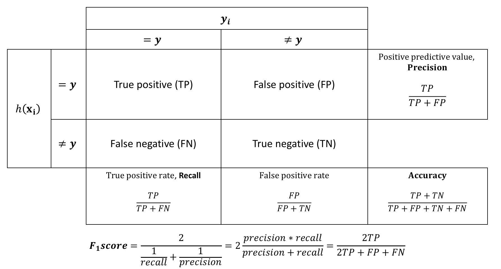
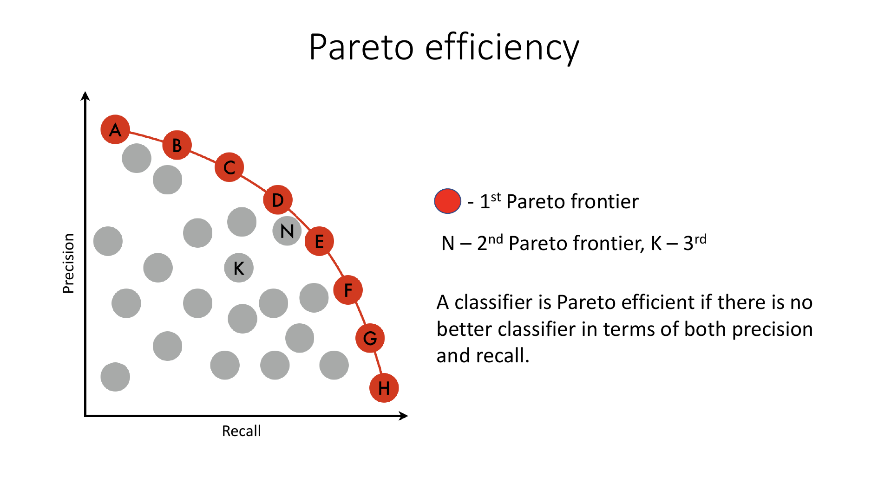
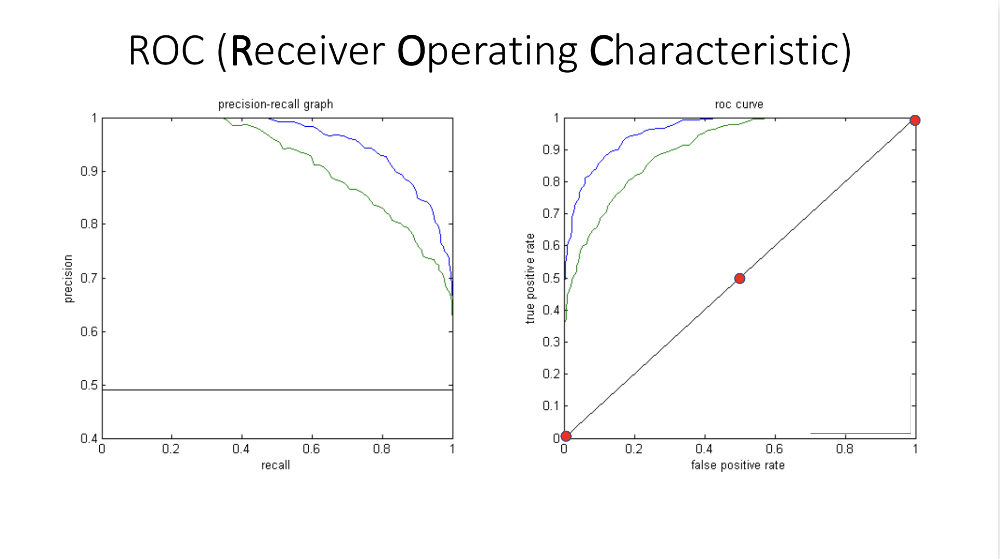
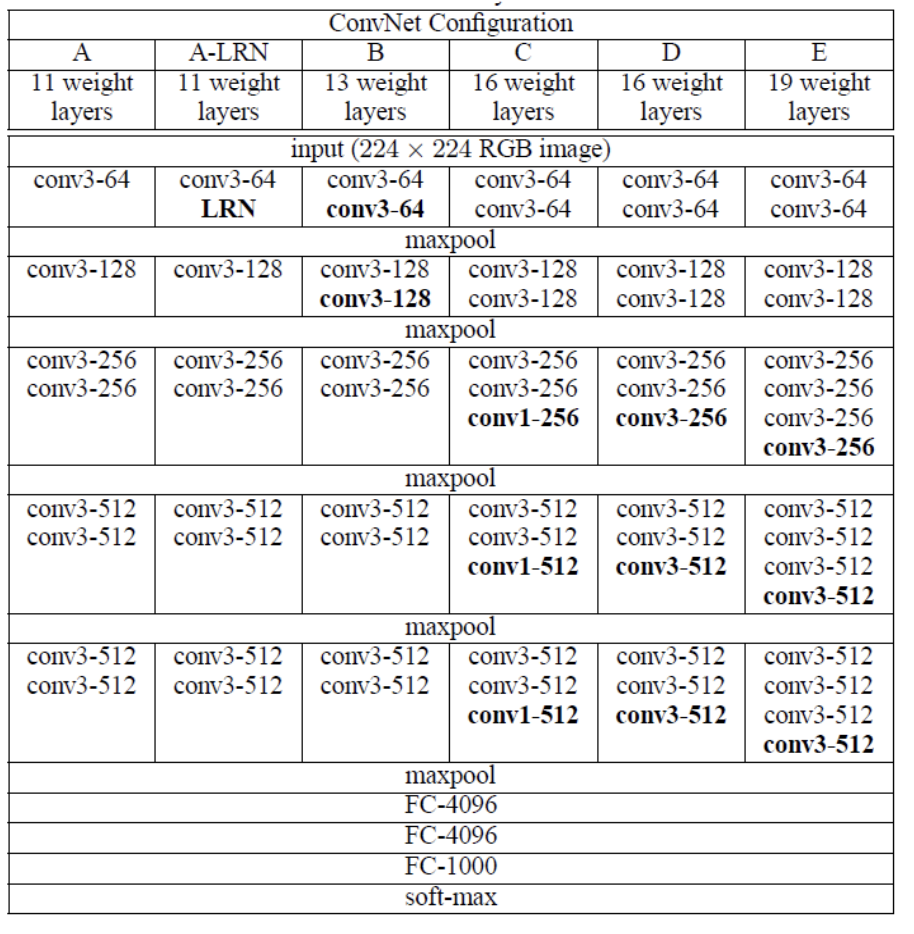
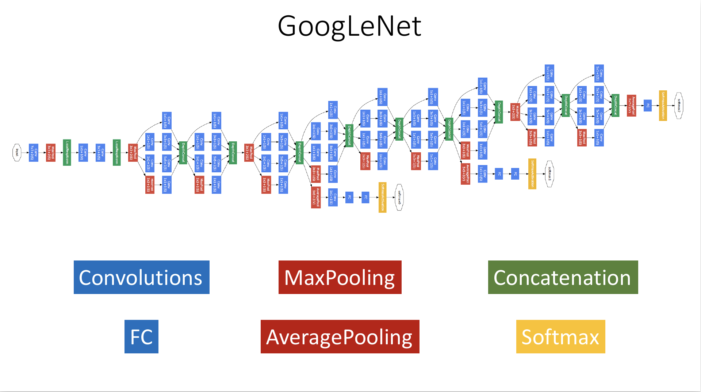
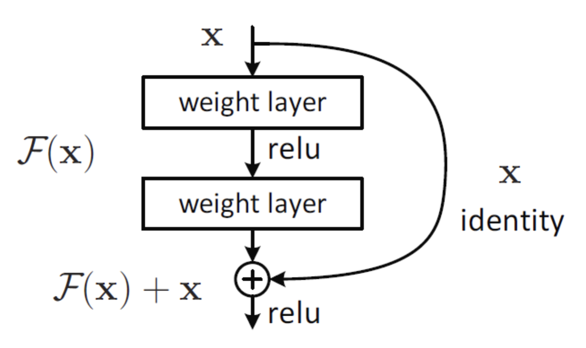
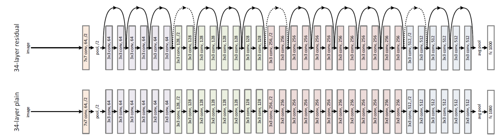

## 3.1 Оценка классификатора. Точность, полнота. Фронт паретто. ROC кривая и AUC

[Момент в лекции](https://youtu.be/j1zFT3ep6O0?list=PLxMpIvWUjaJsttwLkYi-uEydy6R9Hk2-v&t=1313)\
Таблица, описывающая все случаи того, что может произойти с классификатором

Сверху указан реальных класс\
h($x_i$) - то, что выдает наш классификатор\
Возможно 4 случая:

1) True positive - точка принадлежит классу и мы правильно ее отнесли
2) True negative - точка не принадлежит классу и мы ее к классу не отнесли
3) False positive - точка не принадлежит классу, но мы ее отнесли к нему
4) False negative - точка принадлежит классу, но мы ее не отнесли к нему\

По сути последние 2 случая можно определить как ошибки первого и второго рода

Метрики:\

1) Точность или аккуратность\
   $Accuracy = \frac{TP\ +\ TN}{TP\ +\ FP\ +\ TN\ +\ + FN}$\
   Проблема случается, когда классы несбалансированны.\
   К примеру рак встречается не так часто, пусть 1%\
   Тогда можем представить очень простой классификатор, который говорит, что рака в принципе не существует, все точки
   будем
   классифицировать как доброкачественные (на самом деле их 99%).
   Таким образом получим, что accuracy будет равен 99%
2) $Precision = \frac{TP}{TP\ +\ FP}$
3) Полнота (Recall, True positive rate) \
   $\frac{TP}{TP\ +\ FN}$
4) $False\ positive\ rate = \frac{FP}{FP\ +\ TN}$

Заметим, что полнота с precision связаны обратно пропорционально. Однако обе метрики мы хотим как можно больше
и часто нужно решать чем пожертвовать в определенных ситуациях.

Помимо есть метрика:\
$$F_1score = \frac{2}{\frac{1}{recall}\ + \frac{1}{precision}} =2 \frac{precision\ *\ recall}{precision\ +\ recall}$$

### Фронт Парето

Допустим мы сделали много экспериментов, разные классификаторы, threshold и получилось пространство precision/recall,
каждая точка которого - классификатор.

Серые точки нам не интересны, так как над ними есть классификаторы, лучшие и по precision и по recall.\
Самые хорошие точки по этим метрикам и называются Фронт Парето (красные точки)

### ROC кривая и AUC

На картинке представлены 2 классификатора с разными threshold, получились 2 кривые. Синий точно лучше, чем зеленый.\
На картинке справа есть 3 точки. Верхняя отображает случай, когда все точки попали в положительный класс, средняя -
подбрасывание монетки, нижняя - все в отрицательный класс.\
Чем ближе к диагонали, тем хуже классификатор.\
Хотим наибольший AUC (Area Under ROC Curve, площадь под roc кривой)

### Предсказание на доп вопросы:

1) При увеличении threshold увеличивается precision или recall?\
   Ответ: Precision, так как threshold прямо пропорционален ему
2) Почему худшая площадь под ROC кривой 0.5, а не > 0.5?
   Ответ: Потому что в таком случае мы хорошо угадываем классы, но путаем их. Если поменять местами классы, то кривая
   отразится и площадь станет > 0.5.

## 3.2 Сверточные нейронные сети. VGG, GoogleNet, ResNet

[Момент в лекции](https://youtu.be/jTKUzredMhA?list=PLxMpIvWUjaJsttwLkYi-uEydy6R9Hk2-v&t=3891)

### VGGNet
Не нужны никакие свертки, кроме 3x3. Потому что последовательная свертка 3x3 заменяет собой более большие свертки.
Давайте возьмем свертку 3x3 и представим, что она уже является результатом сверки 3x3. Получится, что если мы сделаем 2
свертки, то поле зрения будет такое же, что и у свертки 5x5. Если еще раз, то 7x7

Однако если сделаем свертку 7x7, то 49 чисел, если же 3 свертки 3x3, то получим 3\*3\*3 = 27 чисел

### GoogleNet
Решение, если есть много денег\
Идея: будем делать свертки 1x1, 3x3, 5x5, ... и их все просто складывать.

Модуль же с кучей сверток назывался inception.

Также можно заметить 3 выходных слоя. На них всех делались предсказания, а потом усредняли и делали общее предсказание

### ResNet
В Microsoft заметили, что в GoogleNet теряется какая-то информация, когда делается много сверток.\
По итогу было решено просто сохранять и переносить эту информацию. Чтобы информация не терялась будем складывать свертку с инпутом.

То, что показано на изображении называется skip-connection.\
Много skip-connection'ов и есть ResNet

### Предсказание на доп вопросы:

1) Зачем делать свертку 1x1?
   Ответ: Важно помнить, что это свертка 1x1x?, где ? - какое-то число. Это хороший способ уменьшать число слоев и каналов.
