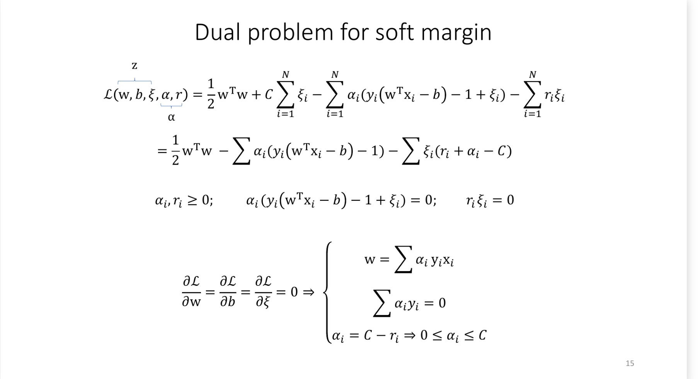
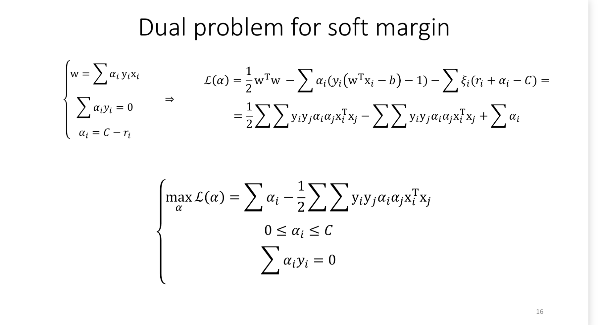
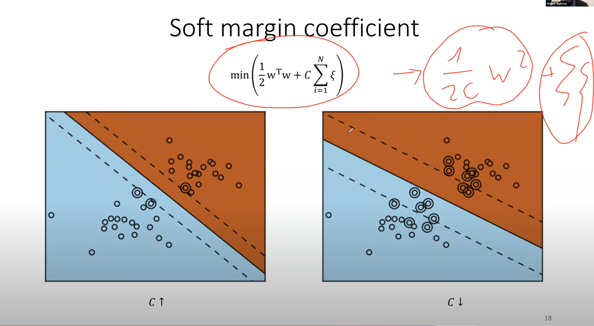

# 5.1 Подготовка признаков. One-hot-encoding. Scalers: MinMax, MaxAbs, Standard, Robust

[Момент в лекции](https://youtu.be/j1zFT3ep6O0?list=PLxMpIvWUjaJsttwLkYi-uEydy6R9Hk2-v&t=3129)

## Проблемы

1. Пусть есть метрическое пространство, считаем евклидово расстояние. Но по некорые фичи могут иметь слишком маленький разброс относительно других фич, поэтому почти не окажут влияние на расстояние. Хотим уметь масштабировать и нормализовывать данные.
2. Даны категориальные фичи, хотим уметь представлять их как числа, не создавая ложный порядок и расстояние

## One-hot-encoding

One-hot-encoding (OHE) используется для преобразования категориальных фич в числовой формат. Каждая уникальная категория превращается в отдельный бинарный столбец.

### Пример

| Цвет  | red | green | blue |
| ----- | --- | ----- | ---- |
| red   | 1   | 0     | 0    |
| green | 0   | 1     | 0    |
| blue  | 0   | 0     | 1    |

Таким образом между всеми точками получаем одинаковое расстояние, нет отношения порядка. Минус: увеличивает размерность данных.

## Scalers (масштабирование)

### MinMaxScaler

 **Формула**:  
  $x_{scaled}=\frac{x-min(x)}{max(x)-min(x)} * (max-min)+min$
  
- Приводит значения фич в диапазон $[min, max]$, обычно $[0, 1]$.
- $min(x),\ max(x)$ минимум\максимум в тренировочных данных. Они же берутся для валидационных и тестовых данных.
- Чувствителен к выбросам

### MaxAbsScaler

 Масштабирует фичи относительно их максимального абсолютного значения.

**Формула**:  
  $x_{scaled} = \frac{x}{\max(|x|)}$

- Сохраняет разреженность (sparsity) данных (нули это хорошо, например для матричных вычислений)

### StandardScaler

Переводит в нормальное распределение

**Формула**:  
    $x_{scaled} = \frac{x - mean(x)}{std(x)}$

- $mean(x)$ - среднее значние, $std(x)$ - стандартное отклонение
- Подходит для фич, распределённых близко к нормальному распределению.

### RobustScaler

 Устойчив к выбросам. Берёт среднюю часть точек и нормирует её. Расстояние до выбросов остаётся большим.

 **Формула**:  
  $x_{scaled} = \frac{x - median(x)}{percentile_{max}(x)-percentile_{min}(x)}$
  
  Обычно  
$x_{scaled} = \frac{x - median(x)}{percentile_{0.75}(x)-percentile_{0.25}(x)}$

# 5.2 SVM. Линейно неразделимая выборка. Модификация решения обратной задачи. Типы опорных векторов

[Момент в лекции](https://youtu.be/GpPDPrpIWy4?list=PLxMpIvWUjaJsttwLkYi-uEydy6R9Hk2-v&t=3294)

[ККТ в лекции](https://youtu.be/GpPDPrpIWy4?list=PLxMpIvWUjaJsttwLkYi-uEydy6R9Hk2-v&t=1974)

## 1. Линейно неразделимая выборка

Линейно неразделимые выборки возникают, когда невозможно провести гиперплоскость,
 разделяющую данные без ошибок. Для таких случаев вводится **мягкий предел** (*Soft Margin*), позволяющий некоторым точкам нарушать ограничения.

## Модификация задачи

**Формулы**:

- Было для линейно разделимой выборки:
  
$$
\left\lbrace \begin{array}{l}
    \frac{1}{2}w^Tw \rightarrow  \min \\
  y_i(w^Tx_i-b)\geq 1
\end{array} \right.
$$

- Cтало для неразделимой:

$$
\left\lbrace  \begin{array}{l}
    \frac{1}{2}w^Tw + C\sum^N_{i=1}\xi_i \rightarrow  \min \\
  y_i(w^Tx_i-b)\geq 1 - \xi_i \\
  \xi_i \geq 0
\end{array}\right.
$$

  $\xi_i$ — переменные ошибок, позволяющие некоторым объектам попадать в полосу или в другой класс
  
  $C$ — коэффициент, отвечает количество ошибок и ширину разделяющего пространства.

##  Двойственная задача

> ### Условия Каруша—Куна—Таккера
> 

 

Дальше из ККТ подстановкой в $L$ получаем такую формулу и условия:
 

## Типы опорных векторов

У нас есть условия: 

$$
\left\lbrace  \begin{array}{l}
  w = \sum a_iy_ix_i\\
  y_i(w^Tx_i-b)\geq 1 - \xi_i \\
  a_i = C - r_i \\ 
  a_i(y_i(w^Tx_i-b)-1+\xi_i)=0 \\
  r_i\xi_i = 0
\end{array} \right.
$$

Из них следует три случая: 

1. **Внутренние векторы**:
   - $\alpha_i = 0$, $\xi_i = 0$, $y_i (w^T x_i - b) \geq 1$.
   - Эти точки не влияют на гиперплоскость, так как их множитель Лагранжа равен нулю, они находятся внутри границ.

2. **Хорошие опорные векторы**:
   - $0 < \alpha_i < C$, $\xi_i = 0$, $y_i (w^T x_i - b) = 1$.
   - Эти точки находятся на границе разделяющего пространства и определяют его.

3. **Плохие опорные векторы**:
   - $\alpha_i = C$, $\xi_i > 0$, $y_i (w^T x_i - b) \leq 1$.
   - Эти точки нарушают ограничение, находятся в неправильном классе или внутри разделяющей полосы.

##  Soft margin coefficient

 
