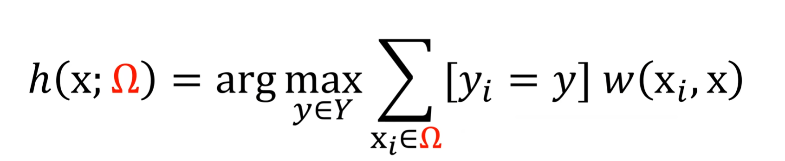
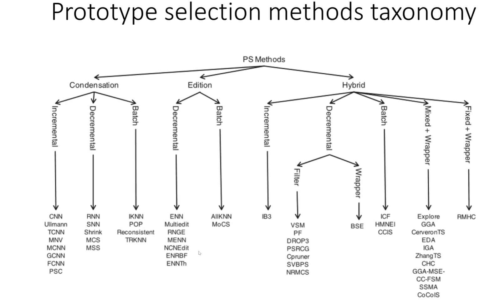
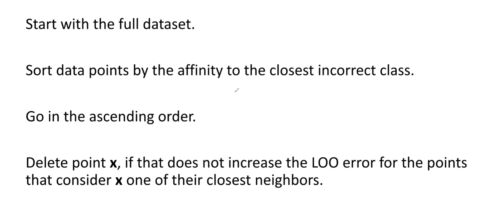
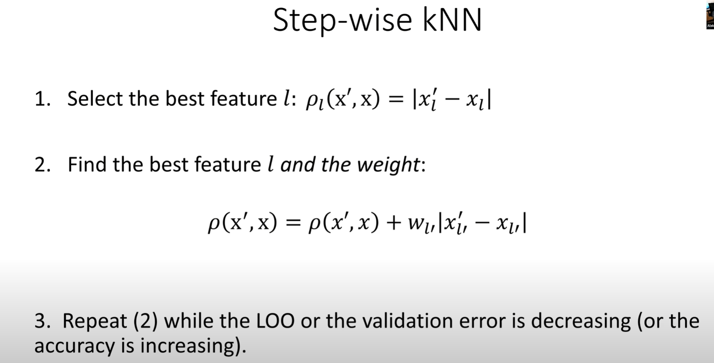
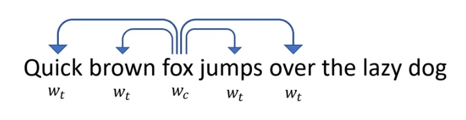
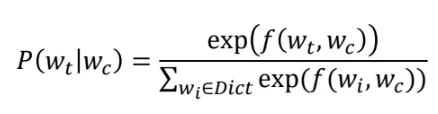
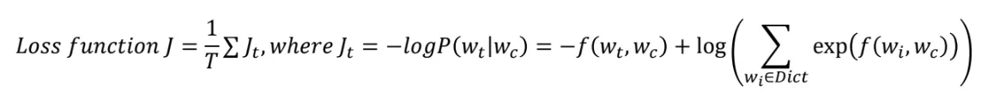
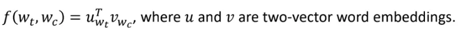
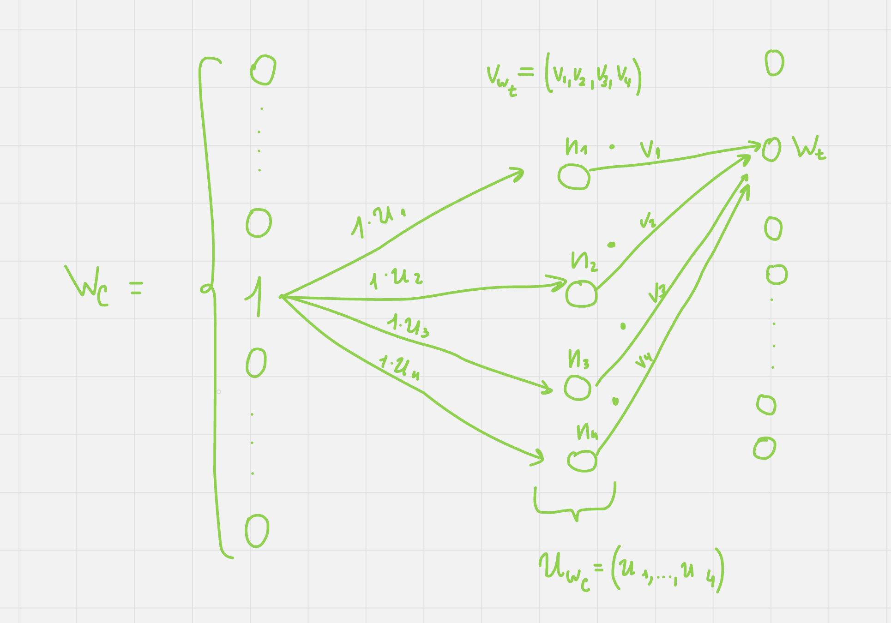

## 6.1 kNN. Отбор эталонов, DROP5. KDTree.

[Момент с лекции](https://youtu.be/j1zFT3ep6O0?list=PLxMpIvWUjaJsttwLkYi-uEydy6R9Hk2-v&t=4055)

**kNN** - k nearest neighboors. Метод для решения задач классификации.

Есть гипотеза для x, которая имеет вид:
$h(x;D) = argmax_{y \in Y}(\sum_{x_i \in D}[y_i = y]w(x_i, x))$
(Берем тот класс y, для которого сумма оказалась больше)

И мы хотим определить функцию $w(x_i, x)$ так, чтобы она была больше, когда x "близок" к точкам класса $y_i$, и меньше, если x "далек" от точек других классов. То есть определяем класс x по его ближнему окружению.

Метод kNN делает w равной 1, если x_i - один из k ближайших соседей x. Таким образом, которого класса соседей у x больше, в тот класс и определяем x.

**KDTree** - быстрый способ выполнения метода kNN. Из-за того, что подсчет расстояний для kNN происходит в очень большом кол-ве, то обычный метод kNN становится медленным. Для этого давайте сузим пространство, на котором будем выбирать соседей.

Итерируясь по размерностям (фичам) находим медиану, среднее или другую величину. По этоу величине делим пространство пополам и продолжаем алгоритм, пока не остановимся.

Таким образом, после каждого деления получаем ноды дерева (пространства точек).

*Момент остановки определяется вычислительными ресурсами, так как чем раньше остановимся, тем больше точек останется в пространстве точки. И наоборот.

Когда на вход нам дали точку, то опять итерируемся по ее коор-там и по условиям сравнения ее фияей с величиной, по которой прежде делили пространство относим либо в 1-ую, либо во 2-ую полвоину. И так далее

Оказавшись в листе поднимаемся нверх находя соседей следующим образом:

а. Поднимаемся по нодам, пока не наберем k соседей, затем запоминаем расстояние X до точки, которая могла бы быть k + 1 соседом.

б. В тот момент, когда все k соседей определились начнем набирать более ближних кандидатов, которые находятся в радиусе X, и выбрасывать тех дальше. 

в. Может возникнуть такая ситуация, что более подходящие кандидаты могут быть в соседнем пространстве и чтобы понять - нужно ли делать лишние сравнения в другом месте, сравним X с расстояним до этого пространства. И если он меньше, то смысла проверять те точки нет.

Когда набрали k соседей и рассмотрели все пространства, находившиеся в радиусе X, больше нет необходимости в лишних сравнениях. 

Алгоритм завершается.

**Отбор эталонов**

Порой из-за долгих вычислений не удается получит результат. И тогда на помощь приходит отбор эталонов, который заключается в сужении датасета на его подмножество определенным образом. 

**Отбор эталонов** делится на 3 типа:

Condensetion: старается оставлять точки внутри класса

Edition: Выделяет точки на границах между классами

Hybrid: Объединение двух типов в некоторой пропорции.

**DROP5**

Декрементальный метод, который уменьшает изначальный датасет.

Бонусы:

1) Похожий метод: Radius neighboors - вместо кол-ва соседей определенного класса, смотрим на классы всех соседей в определенном радиусе.

2) Модификация kNN: Step-wise kNN.

Из-за проблемы размерности, которая говорит о том, что чем больше размерность тем дальше точки из-за увеличения объема, появляются ситуации, когда учитывать все размерности входных данных становится невыгодно с точки зрения функции ошибки.

Поэтому этот метод предлагает следующий итеративный метод с остановкой в добавлении размерностей, если следующая делает LOO хуже.

То есть проверяем эффективность kNN с последовательным добавлением размерностей.

На первом проходе "best feature" - та фича, по которой метод kNN эффективней всего, то есть берем датасет из точек с одной размерностью. 

Когда выбираем (n + 1)-ую фичу, то во-первых нормализируем расстояния, и во-вторых выбираем ее по-принципу как в первом пункте, только учитываем n предыдущих фичей.

3) Для метода kNN и rNN не требуется векторное пространство, поэтому достаточно иметь только определенную функцию различия/расстояния между элементами датасета.

## 6.2 Векторное представление слов. Word2Vec.

[Момент с лекциии](https://youtu.be/wqkQ6qE7KIY?list=PLxMpIvWUjaJsttwLkYi-uEydy6R9Hk2-v&t=1442)

Чтобы работать с текстом в машинном обучении надо как-то его представить, как вектор. Однако мы не можем представить как вектор из букв, тк если картинки отличаются в одном пикселе, то они остаются одинаковыми, а если мы поменяем одну букву в слове, то оно может сильно измениться. Представление слова как вектора называется word embedding.

**Word2Vec**

Поймем, какую функцию от векторов мы хотим максимизировать, а также будем опираться на то, насколько слова часто встречаются рядом.

Посчитаем вероятность того, что вектор $w_t$ встречается в контексте $w_с$ - это просто soft-max от какой-то функции от векторов $f(w_t, w_c)$, которая возрастает, если слова могут стоять рядом, и делим на сумму по всем словам в словаре той же функции (плюс она должна быть дифференцируема).

Далее введем функцию потерь - в ней мы будем максимизировать правдоподобие для слов, которые встречаются рядом, то есть хотим минимизировать отрицательный логарифм. 

Соответственно, если мы максимизируем функцию для слов, которые встречаются рядом, мы автоматически минимизируем ее для тех слов, которые не встречаются рядом.

Функция $f(w_t, w_c)$ - это просто скалярное произведение двух векторов:

Эти же вектора по сути и являются векторами для слов (embendings)

Есть два подхода для решения этой задачи:

1) Представить это в виде нейронки.

Наша нейронка будет состоять из двух слоев. Первый - слой для получения $u_{w_c}$. Второй - слой для получения $f(w_t, w_c)$. Причем кол-во нейронов между первым и вторым слоем заранее особым образом не определено. 

Перед конкретным описанием нейронки для начала представим, как будут выглядеть подаваемые на вход данные. 

Давайте считать, что все слова, с которыми мы работаем помещаются в словарь из 60000 слов. Тогда одно слово (i-ое слово словаря) будет представляться в виде вектора размером 60000, где на i-ой позиции стоит 1, а на других местах 0. Так мы сделали для того, чтобы избежать проблем описанных в методе one-hot encoding.

Таким образом, давайте проведем i-ое слово из словаря (вектор с 1 на i-ой позиции) по первому слою. И сделаем мы это, умножив единицу на вектор $u_{w_c}$, который по-факту представляет из себя набор весов для 1-ого слоя.

И так как умножали 1 на вектор $u_{w_с}$, то для каждого входного слова нейроны между слоями - это веткор $u_{w_c}$. 

Аналогичным образом, домножение на $v_{w_t}$ является вторым слоем, который выводит нас на вероятность встретить слово $w_t$ (после преминения Soft-Max).

Имея функцию потерь и явно заданную нейронную сеть далее просто обучаем её и по завершении получаем вектора, которые кодируют слова $w_c\ и\ w_t$ -> ($u_{w_c}, v_{w_t}$)

**Embedding** - векторное представление слов.
