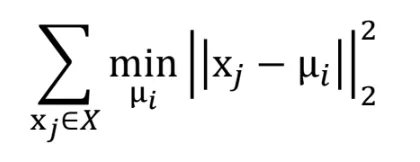
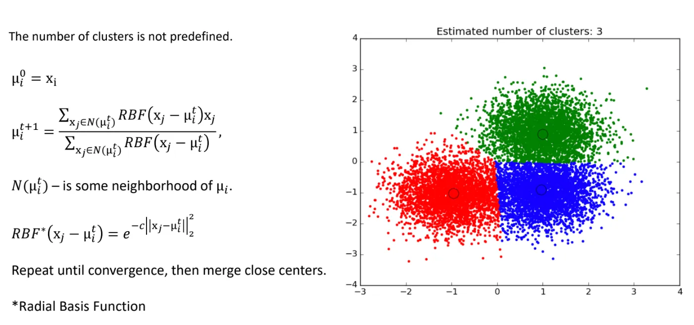
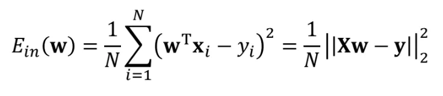
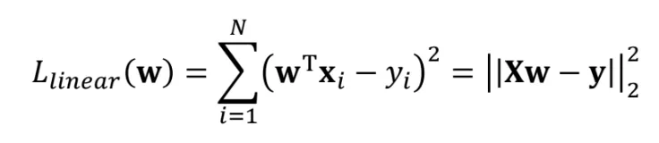
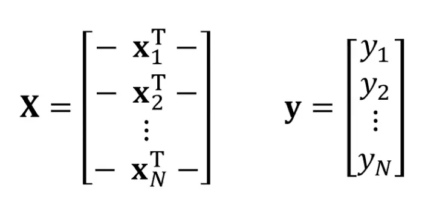
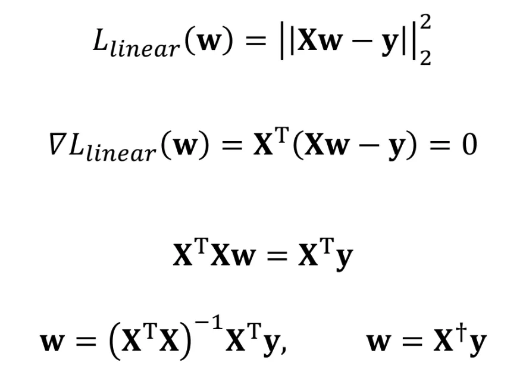
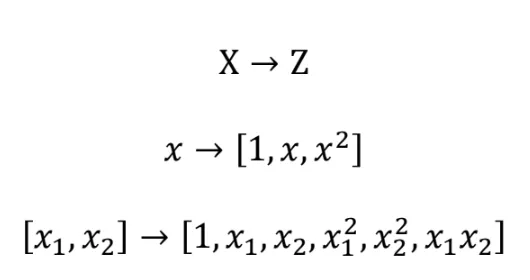
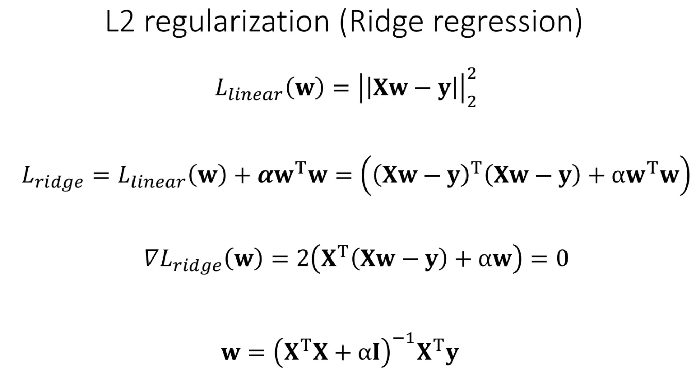
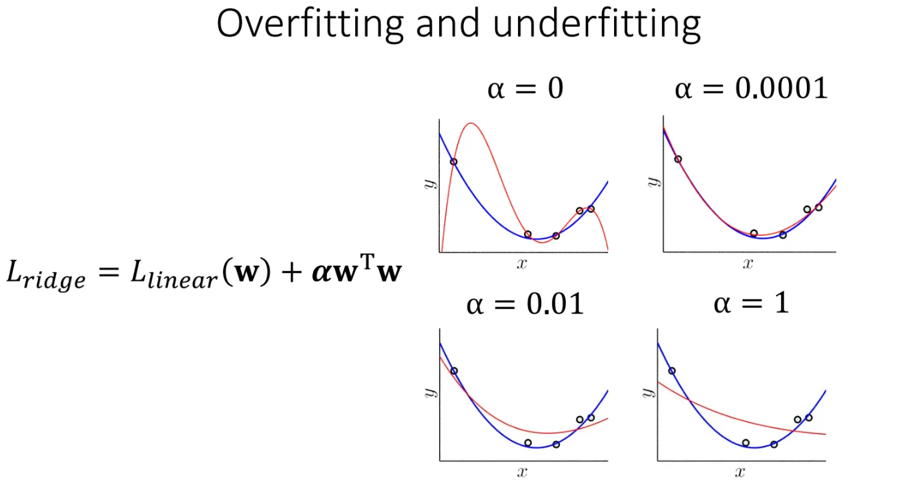
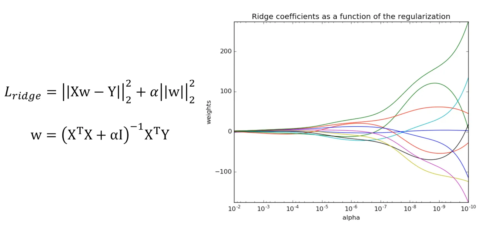

## 8.1 Кластеризация. k-means, k-means ++, meanshift.

[Момент в лекции (где то 38 минута)](https://drive.google.com/file/d/1LqQXsL31swEIHreAZL7ebXBRsjO-HeyA/view?usp=drive_link)

## Clustering. Зачем мы это делаем?

- Получение новой информации: как устроено пространство точек, какие есть скопления
- Создание иерархии объектов: какие группы лежат рядом, какие подгруппы можно объединять
- Упрощение датасета: из миллиона точек сделать 100 кластеров
- Изучение аномалий: какие точки выделяются из общего множества
- Генерация дополнительных признаков: можно разбить точки на кластеры и вместо признаков, отвечающих пространственному положению, можно передавать кластер (с помощью one-hot encoding)

## kMeans: 
Определяет кластеры через центроиды.
Задаем искомое кол-во кластеров.  
Каждый кластер задается его центром.  
Для каждой точки находим ближайший центр и определяем точку этому кластеру.  
Пытаемся минимизировать сумму квадратов расстояний до ближайшего центра: 

**Алгоритм:**

- Выбираем случайные положения центроидов
- На каждой итерации находим точки для каждого кластера
- Центр кластера перемещаем в центр масс кластера (это средний вектор точек) - $\mu_i = \frac{1}{|C_i|}\sum_{x_j \in C_i}x_j$
- Повторяем все шаги, пока не будет устойчивости

*Плюсы*: простой и понятный

*Минусы*:

- нужно векторное пространство
- кластеры могут быть сложной формы и разных размеров
- нужно заранее задавать количество кластеров
- сильно зависит от кол-ва кластеров и от начального положения центроидов

## kMeans++:

**Алгоритм:**

- первый кластер выбираем случайно
- для всех остальных точек считаем расстояние $M(x)$ до выбранного центра
- следующую точку выбираем так, чтобы вероятность выбрать точку подальше была больше (то есть выбираем точку пропорционально $M^2$, где $M$ - расстояние до ближайшего центра). Чтобы это сделать, нанесем квадраты расстояний на отрезок и выберем случайную точку
- повторяем шаги 2-3 ровно $k-1$ раз (чтобы выбрать остальные центроиды)
- запускаем kMeans

## MeanShift:

Не задаем кол-во кластеров. У каждой точки есть ее масса, равная  $e^{-c||x-\mu||^2_2}$, где  $\mu$ – ближайший центр.   
MeanShift смещается в сторону наибольшей ближайшей плотности точек.

**Алгоритм:**

- каждую точку делаем кластером.
- итеративно рассматриваем точки, расстояние до которых > 0 и перемещаем кластер в центр масс соседей
- когда перемещение кластеров меньше $\epsilon$ останавливаемся и объединяем кластеры, которые на меньшем расстоянии, чем $\delta$

*Плюсы*: не нужно количество кластеров

*Минусы*: 
- нужно векторное пространство
- кластеры сложной формы и разных размеров 
- если пространство более разреженное (то есть нет таких плотных скоплений, как на картинке, то результат будет плохим)

## 8.2 Линейная регрессия, полиномиальная регрессия, гребневая регрессия.

[Момент в лекции (где то 28 минута)](https://drive.google.com/file/d/1O12ZzjAGaNAz4L-6_AKs7cWZxPX7D-yY/view?usp=drive_link)

## Линейная регрессия:  
Надо найти линейную функцию с минимальной ошибкой. Обычно функция ошибки – это мат ожидание квадрата разности.

$E_{out}$ - ошибка вне выборки

$E_{in}$ - ошибка внутри выборки

Функцией ошибки мы измеряем качество модели, а функцию потерь мы можем использовать для обучения,  
она используется в качестве замены функции ошибки для упрощения или когда мы не можем напрямую оптимизировать функцию ошибки.

Размерности X,Y:  

Чтобы минимизировать функцию потерь, найдем ее градиент и приравняем к нулю:  

Нашли аналитическое решение задачи регрессии - его можно найти, если матрица $X^TX$ обратима (то есть определитель не равен 0).

## Polynomial regression:  
Пытаемся приблизить полиномиальную функцию.

Идея: добавляем полиномиальных фичей

Но может случиться переобучение - когда модель будет подогнана под датасет, то есть высокий variance.  
Чтобы от этого избавиться, введем регуляризацию.

Мы можем найти опять точное решение $w = (X^TX + \alpha I)^{-1}X^Ty$.
Требуем, чтобы коэффициенты не были сильно большими.  

При добавлении такой регуляризации уменьшаем variance, но повышаем bias (но несильно).

  

На картинке изменение весов при разных коэффициентах регуляризации.

 
Когда вес колеблется между положительными и отрицательными значениям, то это плохо,  
так как  в какой-то момент начинаем переобучаться (например, есть признак - температура,  
и сначала он учитывается положительно, 
то есть имеет положительные веса, а затем отрицательно, получается, что просто подгоняем веса под нашу выборку)

