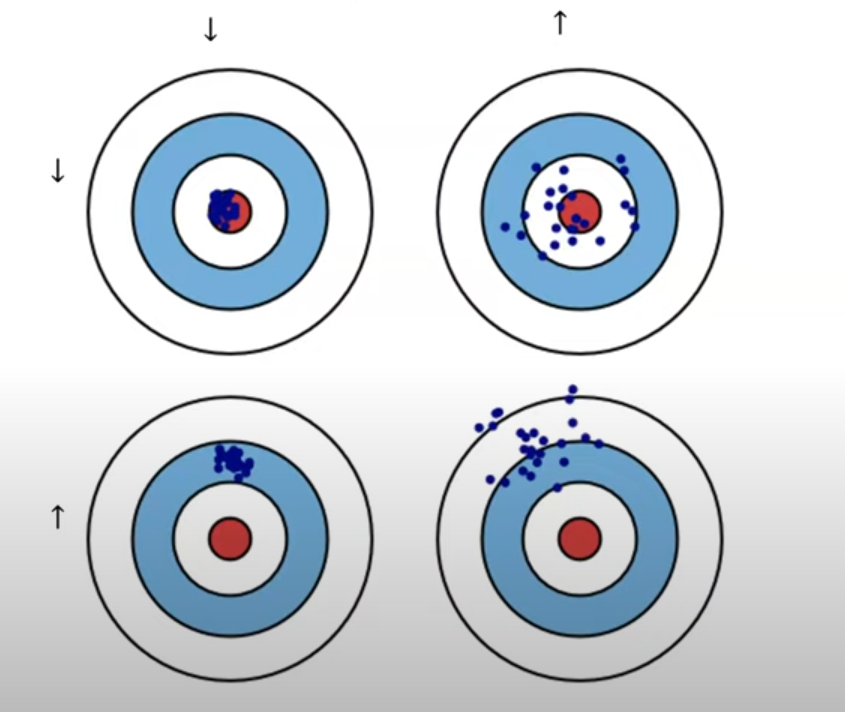
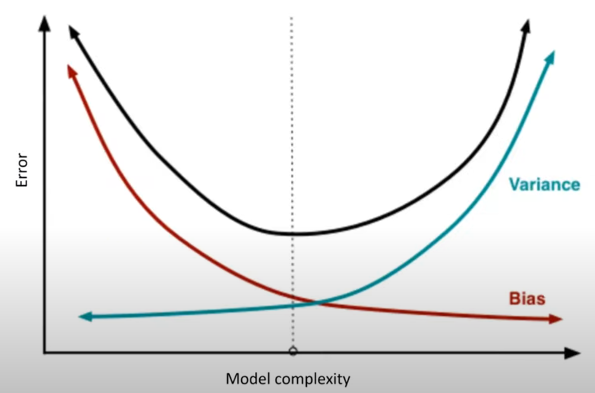
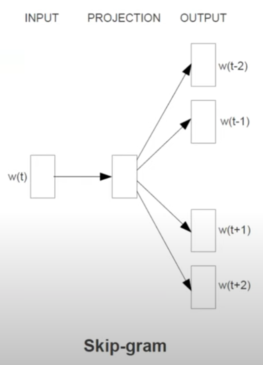
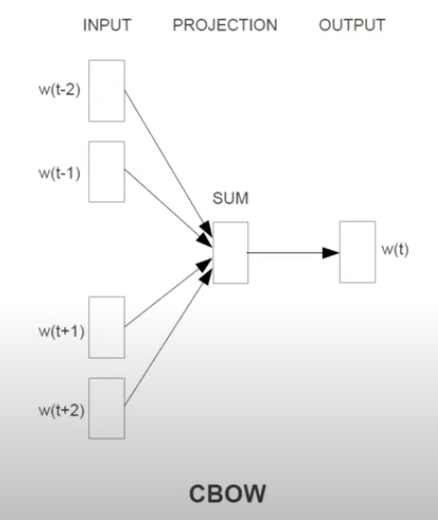
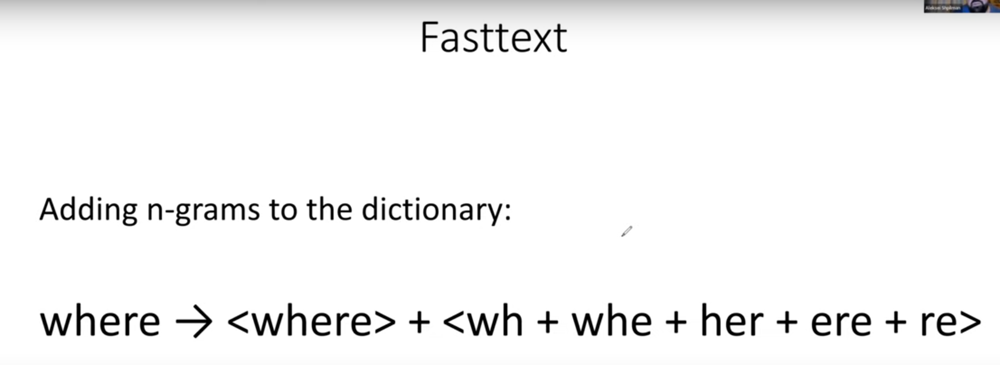

## 10.1 Регрессия. Bias-Variance
https://youtu.be/oJ_cnAQ3ViA?si=9ILpmQHiTv92DECV

Функция, получающаяся при обучении, зависит от датасета, на котором обучается.
Средняя "хорошесть" итоговой модели в смысле ее отклонения от истинной зависимости зависит от выбранного класса функций: от его гибкости, выразительности (линейная модель, дерево решений, SVM и т.п.)
Чтобы как-то описать эти зависимости существует теория Bias-Variance Decomposition
#### Средняя гипотеза

$$
\bar{h}(\mathbf{x}) = \mathbb{E}_D\big[h^D(\mathbf{x})\big]
$$
Это усредненный по всем возможным датасетам результат обучения

#### Декомпозиция ошибки

$$
E_{out}(h^D) = \mathbb{E}_X\Big[(h^D(\mathbf{x}) - f(\mathbf{x}))^2\Big]
$$
Ошибка на конкретном датасете

$$
\mathbb{E}_D\Big[E_{out}(h^D)\Big] = \mathbb{E}_D\Big[\mathbb{E}_X\Big[(h^D(\mathbf{x}) - f(\mathbf{x}))^2\Big]\Big] = \mathbb{E}_X\Big[\mathbb{E}_D\Big[(h^D(\mathbf{x}) - f(\mathbf{x}))^2\Big]\Big]
$$
Хотим посмотреть усредненную по всем датасетам ошибку. Распишем и переставим интегралы.

$$
\mathbb{E}_D\Big[(h^D(\mathbf{x}) - f(\mathbf{x}))^2\Big] = \mathbb{E}_D\Big[((h^D(\mathbf{x}) - \bar{h}(\mathbf{x})) + (\bar{h}(\mathbf{x}) - f(\mathbf{x})))^2\Big]
$$
Добавим и вычтем среднюю гипотезу, чтобы в итоге выразить что-то через нее.

$$
= \mathbb{E}_D\Big[(h^D(\mathbf{x}) - \bar{h}(\mathbf{x}))^2 + (\bar{h}(\mathbf{x}) - f(\mathbf{x}))^2 + \Big]
$$
$$
= \mathbb{E}_D\Big[(h^D(\mathbf{x}) - \bar{h}(\mathbf{x}))^2\Big] + \mathbb{E}_D\Big[(\bar{h}(\mathbf{x}) - f(\mathbf{x}))^2\Big] + \mathbb{E}_D\Big[2(h^D(\mathbf{x}) - \bar{h}(\mathbf{x}))(\bar{h}(\mathbf{x}) - f(\mathbf{x}))\Big]
$$
Второе слагаемое не зависит от датасета, а в последнем второй множитель тоже выносится, а оставшийся зануляется, что следует из определения средней гипотезы. Итого:
$$
= \mathbb{E}_D\Big[(h^D(\mathbf{x}) - \bar{h}(\mathbf{x}))^2\Big] + (\bar{h}(\mathbf{x}) - f(\mathbf{x}))^2
$$
Подставим получившееся обратно в нашу формулу:
$$
= \mathbb{E}_X\Big[\mathbb{E}_D\Big[(h^D(\mathbf{x}) - \bar{h}(\mathbf{x}))^2\Big] + (\bar{h}(\mathbf{x}) - f(\mathbf{x}))^2\Big]
$$
$$
= \mathbb{E}_X\Big[\mathbb{E}_D\Big[(h^D(\mathbf{x}) - \bar{h}(\mathbf{x}))^2\Big]\Big] + \mathbb{E}_X\Big[(\bar{h}(\mathbf{x}) - f(\mathbf{x}))^2\Big] = \text{variance + bias}
$$
Первое слагаемое называется **Variance** и показывает насколько мы в среднем отклоняемся от нашей средней гипотезы, то есть это отражает чувствительность итоговой функции к данным, на которых она обучается.

$$
variance = \mathbb{E}_X\Big[\mathbb{E}_D\Big[(h^D(\mathbf{x}) - \bar{h}(\mathbf{x}))^2\Big]\Big]
$$

Второе cлагаемое называется **Bias** и показывает нам в каком-то смысле лучшую ошибку, которая может получиться при использовании выбранного класса решений.
$$
bias = \mathbb{E}_X\Big[(\bar{h}(\mathbf{x}) - f(\mathbf{x}))^2\Big]
$$

По столбцам variance, по строкам bias

В идеальном случае у нас и то и то низкое.
Чаще нам приходится балансировать: если у модели низкий bias, то скорее всего она очень выразительная и средняя гипотеза очень хорошо находит истинную зависимость, но часто это означает, что модель из-за своей мощности легко переобучается, подстраивается под конкретный датасет. Так происходит, например, с решающими деревьями. 
- Низкий bias - модель в среднем хорошо находит истинную зависимость
- Высокий bias - модель слишком слабая и не может выразить истинную зависимость
- Низкий variance - модель слабо зависит от того, на каком датасете ее обучили и результат обучения легко прогнозируется.
- Высокий variance - модель сильно зависит от данных при обучении и результат сложно прогнозировать

При обучении $E_{in}$ (или $E_{train}$) это наша оценка на bias, т.к. это ошибка на подмножестве иксов.
А $(E_{val} - E_{train})$ - наша оценка на variance, т.к. она показывает, насколько наша ошибка зависит от датасета на обучении.

Иллюстрация Bias-Variance tradeoff

**Возможный вопрос: что хуже - высокий bias или высокий variance?**

Ответ: с высоким biasом ничего не сделать, а вот с высоким variance можно. Например, добавить регуляризацию или сделать ансамбль из нескольких моделей. Но про это в других билетах, кажется...

---

## 10.2 Векторные представления слов. CBOW, Skip-gram, Fasttext

https://youtu.be/wqkQ6qE7KIY?si=sSQsqEJdbvCo2tZQ&t=2333

#### Negative sampling
Какая проблема была у word2vec? Дорогой в вычислении знаменатель! Мы считаем экспоненту "размер словаря" раз:
$$
P(w_t | w_c) = \frac{\exp(f(w_t, w_c))}{\sum_{w_i \in Dict} \exp(f(w_i, w_c))}
$$
$$
\text{Loss function } J = \frac{1}{T} \sum J_t, \text{ where } J_t = -\log P(w_t | w_c) = -f(w_t, w_c) + \log\left( \sum_{w_i \in Dict} \exp(f(w_i, w_c)) \right)
$$
T - размер окна контекста.

Идея: поменяем $J_t$ и скажем, что мы хотим максимизировать вероятность нашего таргет-слова $f(w_t, w_c)$ и минимизировать вероятность для k случайных слов (то есть максимизировать 1-p, что и используется в формуле с сигмоидой), т.к. они вряд ли встречаются рядом с контекстным словом (из-за рандома там может оказаться и хорошее слово, но такое будет редко)

Теперь вместо $-\log{P(w_t | w_c)}$ считается новая $J_t$

$$
J_t = -\Big(\log \sigma(f(w_t, w_c)) + \sum_{j=1}^{k} \log \sigma(-f(w_j, w_c)) \Big)
$$

Негативные сэмплы сэмплируются из словаря по какому-то распределению (например, используется равномерное в степени 3/4)
#### Skip-gram

Skip-gram = word2vec + negative sampling

По слову контекста предсказываем вероятности таргет-слов jоптимизируя функцию из Negative sampling

#### CBOW (Continuous Bag Of Words)

Обратная к Skip-gram идея: берем таргет-слова и пытаемся по их сумме восстановить слово посередине. Из-за суммы взаимное расположение теряется, поэтому можно сказать, что мы смотрим на "мешок слов"
Здесь мы также используем Negative Sampling максимизируя вероятность пропущенного слова и минимизируя для рандомных. 

#### Fasttext

Идея: различных слов очень много и наша модель должна как-то обрабатывать слова, которые она никогда не видела при обучении + однокоренные слова должны быть похожи в своих представлениях. Давайте будем обучать вектора не только для целых слов, но и для их кусочков. Здесь мы добавляем < ... > в начало и конец, чтобы подчеркнуть роль  n-граммы в начале и в конце.
Теперь для каждого слова все вектора (включая вектор исходного слова, если оно есть) складываются и мы в любом случае получим какое-то представление для слова.
Ниже пример для 3-грам. (кстати необязательно все должны быть одной длины)

