## 11.1 Регрессия. Борьба с выбросами. Theil-Sen, RANSAC, Huber

https://youtu.be/8RM6OYFjW1g?si=DJzlz701ogSXIIbm&t=1168

Обычная линейная регрессия с MSE чувствительна к выбросам в данных. Что делать?
## Theil-Sen Regressor

Обучаем модель на подмножествах Х и берем медиану по результатам (геометрическую или покоординатную)

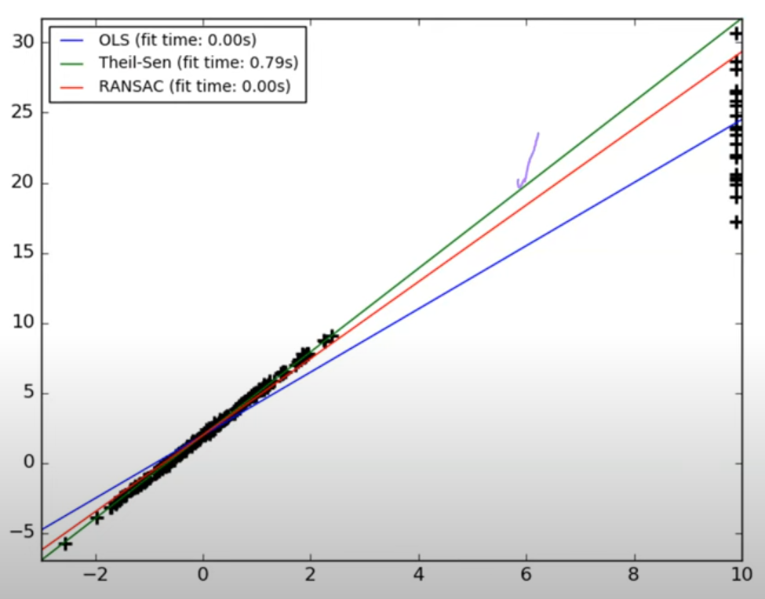

## RANSAC: RANdom SAmple Consensus

Обучаем модель на подмножествах Х и берем лучшую с точки зрения количества точек попадающих в полосу +-d около решающей прямой (inliers)
Обучаем финальную модель на этих inliers.
d - гиперпараметр

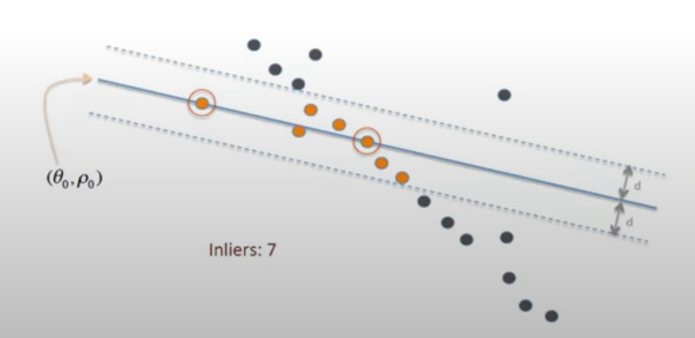

&nbsp;

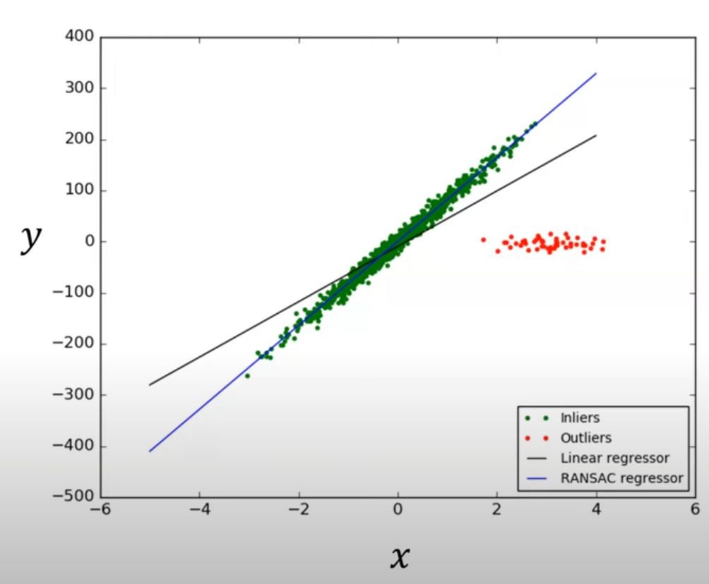

## Huber Regressor

Идея: обычную регрессию "тянет" к выбросам, потому что ошибка на них большая и ее выгодно оптимизировать. Можно сделать функцию потерь, которая маленькие ошибки штрафует квадратично, а большие - линейно. 

Перед применением функции H отклонение дополнительно нормируется на $\sigma$, и потом умножается и складывается с ним для нормализации отклонений. 

$$
\min_{w, \sigma} \sum_{i=1}^{N} \left( \sigma + H_{\epsilon}\left(\frac{x_i w - y_i}{\sigma}\right)\sigma \right) + \alpha \|w\|_2^2
$$

$$
H_{\epsilon}(z) = \begin{cases}
 z^2, & \text{if } |z| < \epsilon \\
 2\epsilon|z| - \epsilon^2, & \text{if } |z| \geq \epsilon
\end{cases}
$$  
Здесь sigma - обучаемый параметр, а epsilon - гиперпараметр (типично выбирать 1.35)
Из-за усложнения функции обучение приходится делать градиентным спуском.

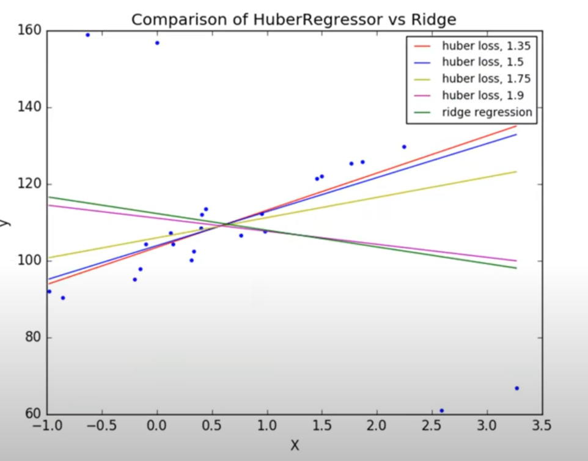

## Сравнение на разных данных
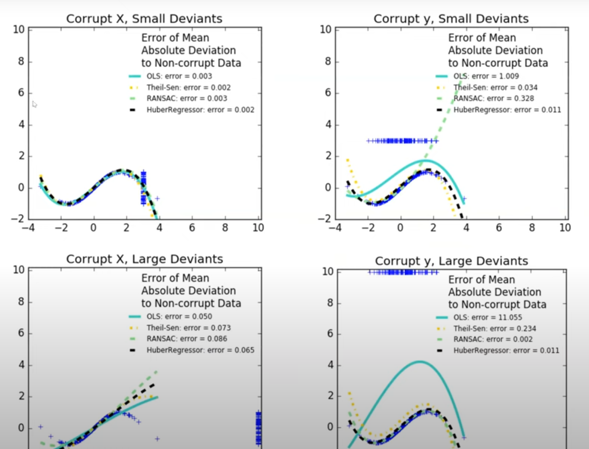

---

## 11.2 Трансформеры, общая архитектура. Attention, self-attention, positional-encoding

https://youtu.be/b0_gqNI-xm4?si=z-5QeusX0fTkp2Bs&t=1253

Идея внимания: для каждого слова можно определять важность остальных слов (на какие стоит обратить "внимание") и в соответствии с этой важностью формировать вектор выхода z, с которым дальше работаем. 
Улучшение трансформера в сравнении с LSTM/RNN в том, что там мы пытались в один или два вектора запихнуть всю информацию о предложении, из-за чего были потери информации.
Здесь мы заводим свой вектор контекста под КАЖДОЕ слово предложения.
К тому же подсчеты параллелятся

Блок Encoder будет заниматься кодированием нашего входного предложения, делая выжимку информации из него.
Архитектура Encoder блока сделана так, что его можно применить несколько раз, в теории увеличивая высокоуровневость представлений для слов.

Блок Decoder будет использовать информацию из Encoderа и авторегрессивно генерировать ответ как и в LSTM, то есть генерим по одному слову и присоединяем его на вход Decoderа, пока не сгенерируется токен конца предложения. 

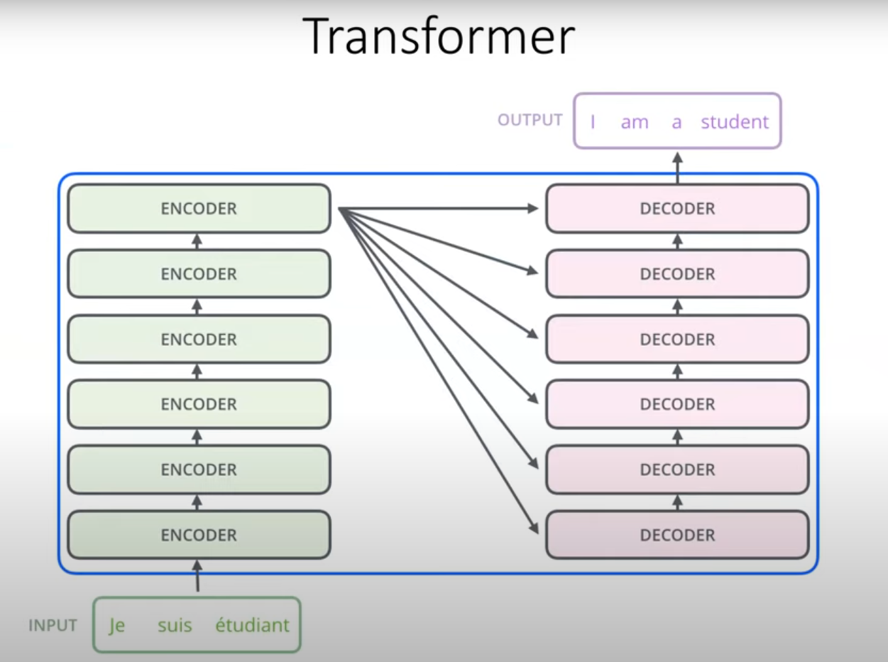

https://youtu.be/b0_gqNI-xm4?si=LMsGZuAL2azfYvJc&t=1662
## Self-attention

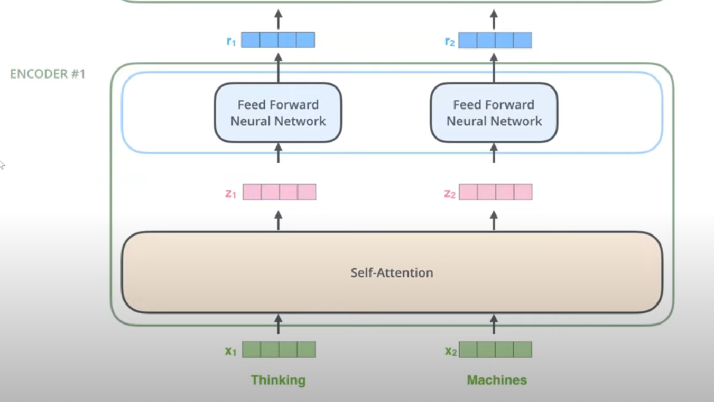

После блока self-attention каждый $z_i$ хранит в себе выжимку предложения в контексте i-го слова.

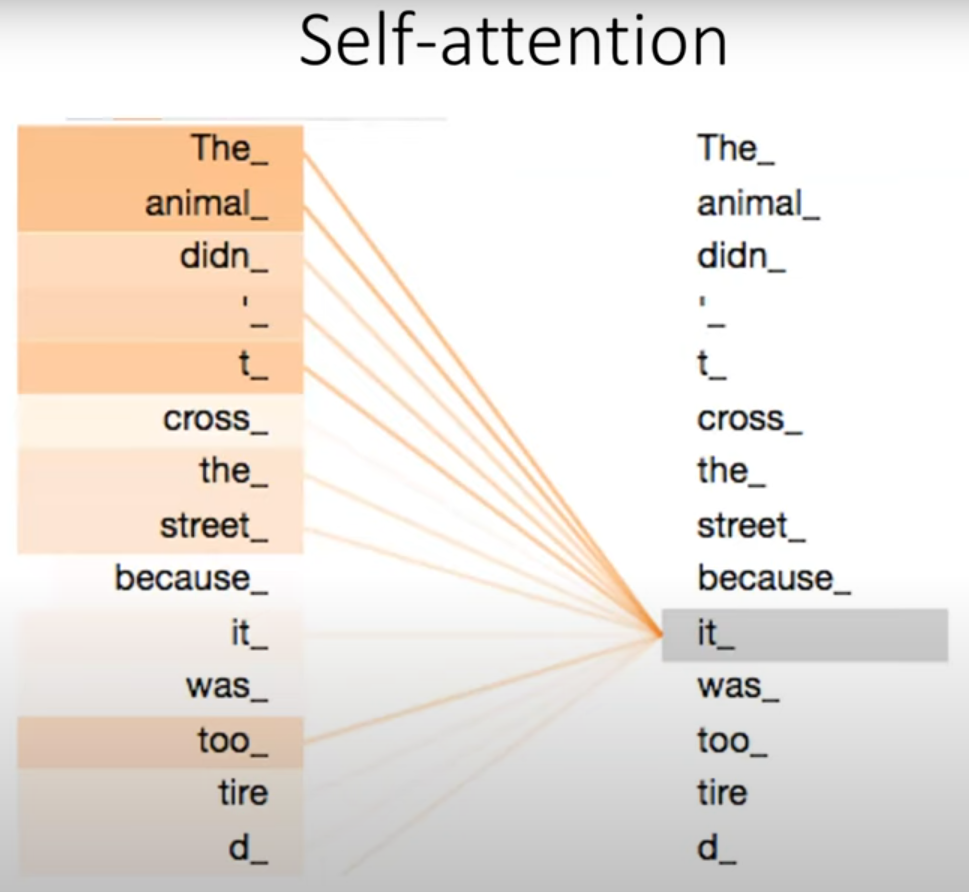

Идея: для каждого слова будет вектор внимания, который говорит о связи нашего слова (it) со всеми остальными.

Self-attention потому что мы смотрим на слово из этого же предложения.

Rem: итоговый self-attention вектор является результатом softmax, откуда сумма равна единице и все значения положительны.

## Positional encoding
https://youtu.be/b0_gqNI-xm4?si=z1r03vKcb3qnM32U&t=2659
Когда мы считаем внимание, позиции наших слов не учитываются и получается "мешок слов". Чтобы избежать потерю пространственной информации придумали добавлять к основному эмбеддингу на вход еще и эмбеддинг позиции

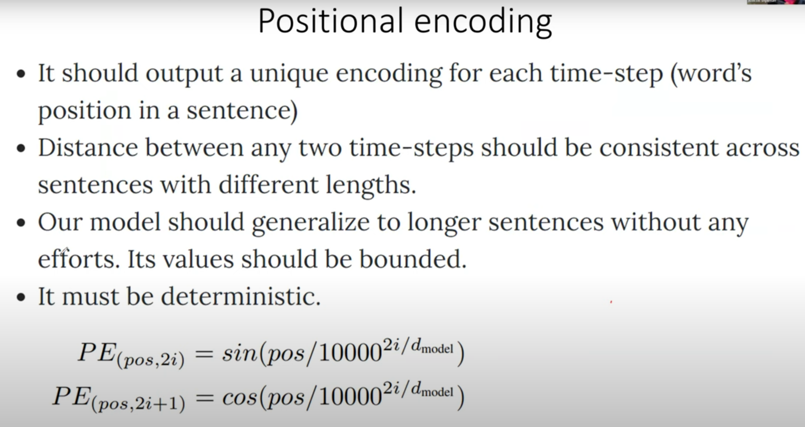

Решение было найдено эмпирически.

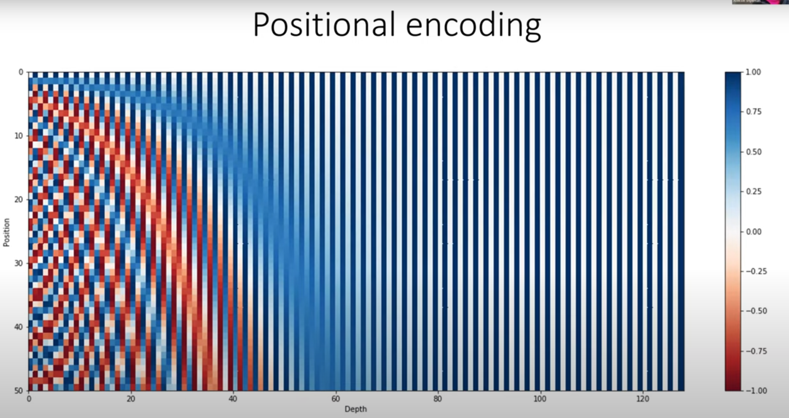

## Attention в Decoder (возможно, лишнее)

Отличие от self-attention в энкодере в том, что self-attention в Decoder на самом деле маскированный на обучении, т.к. при обучении мы видим всю целевую последовательность, то есть можем считать attention для слов впереди, чего мы делать не хотим! В реальности, когда мы генерируем последовательность, никаких слов впереди у нас нет! Маска позволяет обнулить attention для слов впереди нашего слова, для которого мы считаем attention вектор. (перед softmax к ним добавляется -inf). Далее мы используем получившуюся матрицу в качестве матрицы Q для Encoder-Decoder Attention, а в качестве матриц K, V берем матрицу на выходе из энкодера. (K и V будут одинаковые)

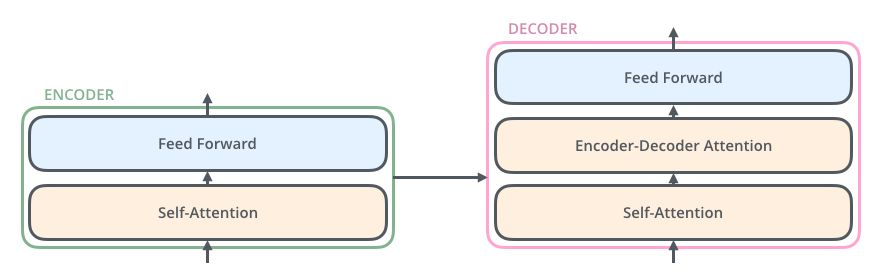

&nbsp;

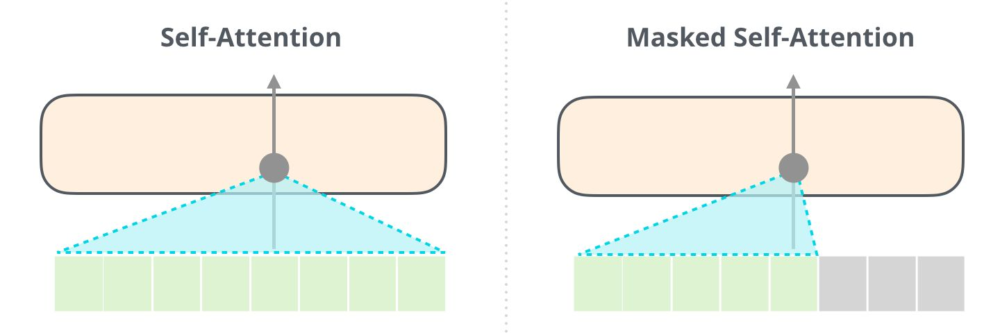
