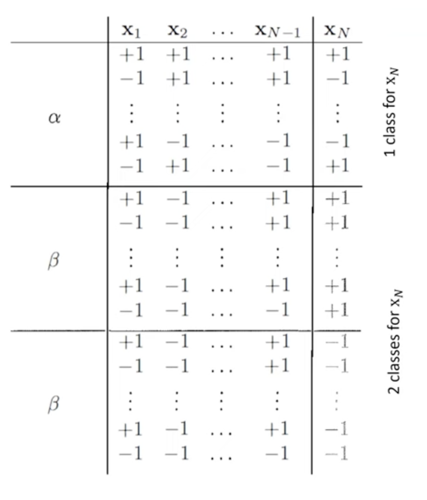
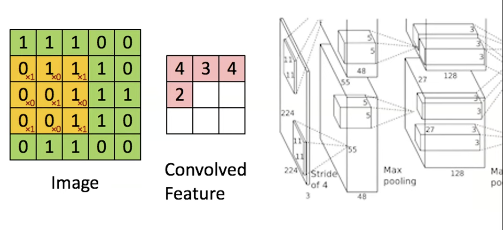
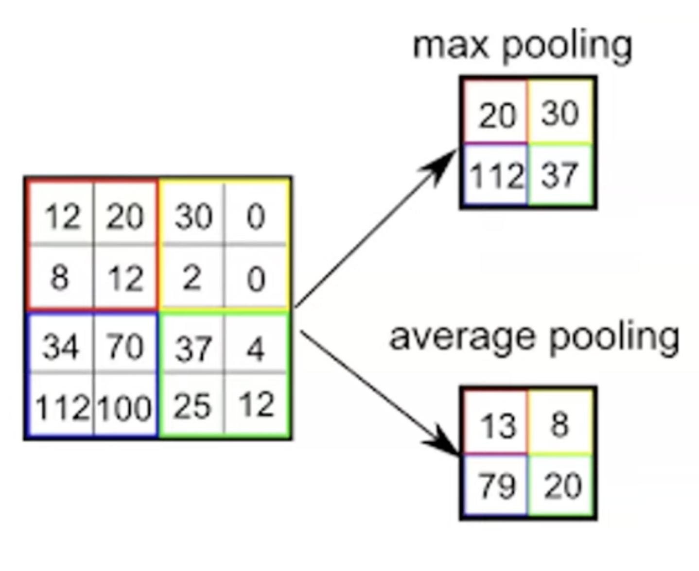
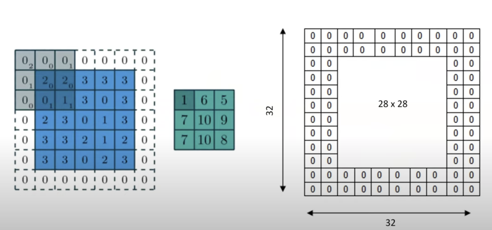
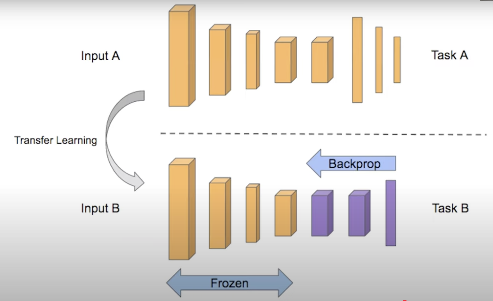

## 12.1 Гипотезы и дихотомии. Функция роста и точка поломки. Доказательство полиномиальности функции роста в присутствии точки поломки.

[лекция](https://youtu.be/8RM6OYFjW1g?si=5XATXK00sW-9epKO&t=2469)

Теория ошибки

$E_{in}(h) = \frac{1}{N}\sum_{i = 1}^{N}e(h(x_n), f(x_n))$ - ошибка внутри выборки. e = 0 или 1 тк ошибка классификации\
$E_{out}(h) = E_x(e(h(x_n), f(x_n))$ - обычно не знаем\
Неравенство Хефтинга $P(|E_{in}(h) - E_{out}(h)| > \epsilon) \leq M2e^{-\epsilon^2N}$, (x - любой, не только из датасета)\
где $|E_{in}(h) - E_{out}(h)|$ - ошибка обобщения\
M - количество гипотез

При достаточно большом N, мы можем гарантировать хороший результат те хорошее обобщение\
Но неравенство хорошее только если у нас одна гипотеза. Если мы начинаем их перебирать в процессе обучения, то все гарантии пропадают

**Гипотеза** - функция $h: X -> Y$. Мы хотим её приблизить к f

Если $h1 \approx h2$ то и $|E_{in}(h1) - E_{out}(h1)| \approx |E_{in}(h2) - E_{out}(h2)|$\
Поэтому мы будем рассматривать дихотомию

**Дихотомия** - множество гипотез, которые различаются между собой на нашем датасете \
$h: {\textbf{x_1,..x_N}} → {-1, +1}$. Их $\leq 2^N$

**Функция роста** $m_H(N) = max_{x_1..x_N} |H(\textbf{x_1,..x_N})| \leq 2^N$ Максимальное количество дихотомий на N точках при классе гипотез H

**Точка поломки** $min(k : m_H(k) < 2^k)$. Минимальное число точек, на котором $2^k$ не достигается

Неравенство Вапника-Червоненко (VS Inequality) $P(|E_{in}(h) - E_{out}(h)| > \epsilon) \leq m_H(2N)\cdot 4e^{-\epsilonN/8}$

Если $m_H$ - экспоненциальная, то у нас нет никаких гарантий. Но если полиномиальная то она есть

### Теорема
#### Если есть точка поломки, то функция роста - полиномиальная

Доказательство\
Переходим к представлению в виде бинарных строк. У нас теперь есть строка из +-1 длины N. Таких строк у нас B(N, k), 
оно соответствует числу уникальных гипотез те строки не могут повторяться. k - 1 здесь это максимальное число 
столбцов в которых все элементы совпадают.

$B(N, k) = m_H(N)$ с точкой поломки k. Представим в виде $B(N, k) - \alpha + 2\beta$\
Смотрим на последний элемент строки и на часть $(x_1, .. x_{N - 1})$. Если от встретился два раза (те с разным последним элементом),
то относим в группу $\beta$ иначе в $\alpha$

$\alpha + \beta \leq B(N - 1, k)$ тк соответствуют уникальным строкам\
$\beta \leq B(N - 1, k - 1)$ все строки уникальные. Пусть там не k-1, а k. \
Тогда существует k - 1 одинаковый столбец, но теперь добавим последний точно одинаковый столбец.\
Получим k одинаковых столбцов для N точек. А мы знаем что их не более k - 1. 

Получили выражение\
$B(N, k) \leq B(N - 1, k) + B(N - 1, k - 1)$

Мат. Индукция, что $B(N, k) \leq \sum_{i = 0}^{k - 1} \binom{N}{i}$\
База. $B(N, 1) = 1$, $B(1, k > 1) = 2$\
ИП. $B(N, k) \leq B(N - 1, k) + B(N - 1, k - 1) \leq \sum_{i = 0}^{k - 1} \binom{N - 1}{i} + \sum_{i = 0}^{k - 2} \binom{N - 1}{i} =$
$= 1 + \sum_{i = 1}^{k - 1} \binom{N - 1}{i} + \sum_{i = 1}^{k - 1} \binom{N - 1}{i - 1} = \sum_{i = 0}^{k - 1} \binom{N}{i}$

## 12.2 Сверточные нейронные сети. Свертки, max pooling, padding. Трансферное обучение.

[лекция](https://youtu.be/jTKUzredMhA?si=7VkPJpPnZg6_npwS&t=1441)

Пробегаемся ядром по изначальной картинке. Причем в ядре мы можем выделять диагональные линии (как в примере), горизонтальные и тд\
Поэтому после первого шага мы получаем матрицу размерности 3 тк это целый набор сжатых данных. Поэтому дальше мы будем накладывать маску-куб .
Размерность толщины также будет расти если мы используем несколько каналов для передачи цвета

Параметры свертки: 
* kernel - ядро: 3x3 и обычно не пишут 3x3xТолщина прошлого слоя - размер накладываемой маски
* stride - шаг свертки - сдвиг ядра по осям - отвечает за размер линейного сжатия

### Pooling
Способ сжатия сетки с сохранением сигнала. Мы из каждой области берем max или average

Пример, kernel 2x2, stride 2

### Padding
Борьба с обрезанными краями. Увеличиваем картинку по краям. Если kernel был размера mxn, то добавочка будет толщиной
m / 2 и n / 2 соответственно (с округлением вниз), так чтобы центр свертки попадал в угол.

### Transfer learning

Берем хорошую готовую чужую сетку, отрезаем от нее кусок и вставляем свою маленькую специально нашу. 
Обучаем только этот наш кусочек. И получается неплохо. Важно, что наш learning rate должен быть значительно ниже

### Ликбез в историю
* LeNet - одна из первых сеток с глубоким обучением
* IMGNET - 1000 классов данных 1.2 млн картинок размеченных по категориям
* AlexNet - масштабирует все картинки до 256x256. Оттуда берет рандомный кусок 224ч224 и зеркалит его, расширяет датасет
* VGGNet - доказали, что никакая сверка кроме 3x3 не нужна. Она может из заменить, не хуже и легче. \
Свертка 7x7 - это свертка 3x3 повторенная 3 раза, но число операции 49 или 27
* Google сделал сетку с несколькими выходами
* Microsoft сделал Residual. Суть, а вдруг мы в процессе что-то теряем? давайте иногда изначальную штуку подтягивать. 
Теперь свертка это не просто F(X), а F(X) + X 

Свертка 1x1 это на самом деле свертка 1x1xТолщина поэтому ее используют для уменьшения глубины или замены цветовых каналов

