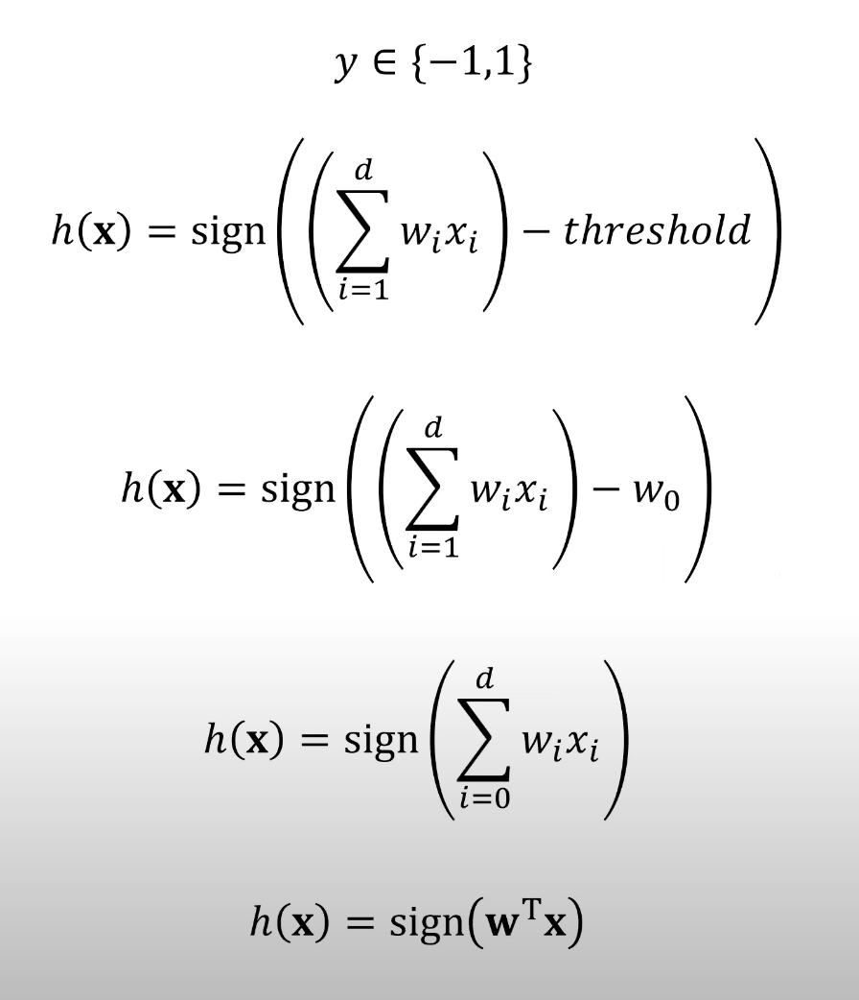
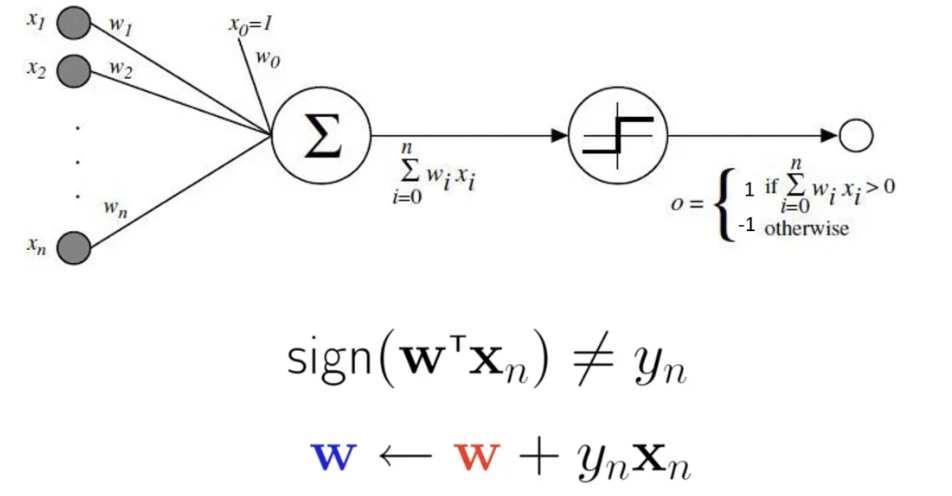
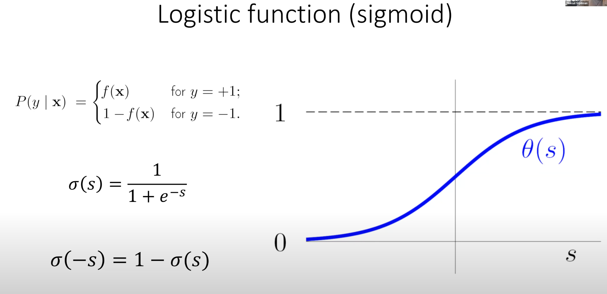
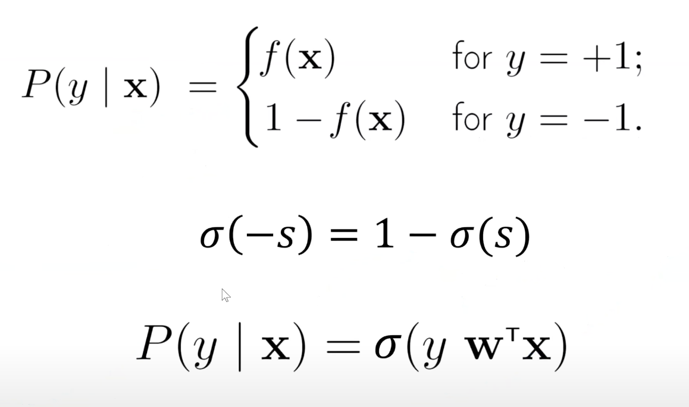
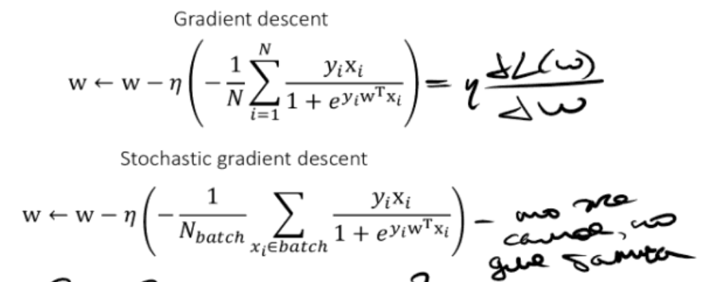
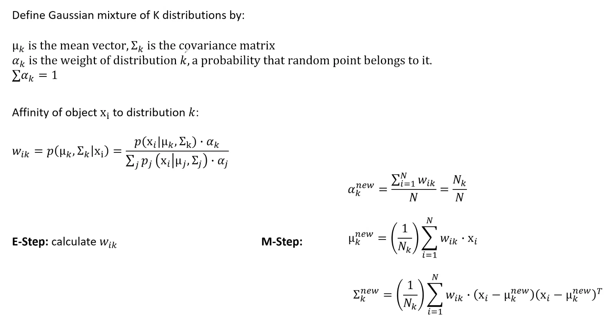

## 14.1) Нейронные сети. Перцептрон. Логистическая регрессия и градиентный спуск.

Лекция: https://www.youtube.com/watch?v=kzhP504D4v8&list=PLxMpIvWUjaJsttwLkYi-uEydy6R9Hk2-v&index=7

Первая нейронная сеть - перцептрон. По сути модель для бинарной классификации. Функция активации - 
$f(x) = 1 \,\,\,\text{если}\,\,\, x > treshhold, -1\,\,\text{иначе}$

Сдвигаем прямую на $y_i||X_i||^2$.

1. Фичи – входные данные
3. Считаем $\sum w_ix_i$
4. Функция трешхолда (sign) – функция активации

Можно добавить много слоев перцептрона
Проблема: такие сети ограничены, хотим что-то умнее. Решение: возьмем другую функцию активации, заменим выходную функцию перцептрона на сигмоиду:$\\$

Понятно, как получить результат. Вероятность попасть в конкретный класс считается так:

Получаем логистическую регрессию (на самом деле решаем задачу классификации, функция нам дает чиселко - а мы по этой чиселке решаем, принадлежит ли точка классу или нет).

Раньше наш лосс - количество неправильно классифицированных точек. Теперь в непрерывном случае удобно рассматривать функцию правдоподобия (логарифм совместной плотности [negative log likely loss]):

Как обучать сеть - градиентный спуск по лоссу логистической регрессии
Хотим на каждом слое минимизировать функцию лосса. На $i$-м слое считаем градиент по нашим весам $w_i$. Спускаемся в обратном направлении градиента с шагом $\eta$.

Есть стохастический градиентный спуск - делим данные на батчи, в пределах одной эпохи считаем градиенты по очередному батчу и спускаемся. Повторяем, пока батчи не закончились.
Веса модели обновляем с помощью back propagation (обратное распространение ошибки) - идем сконца, считаем градиенты и фиксим веса. 

## 14.2) ЕМ-алгоритм.

Алгоритм, который пытается оценить, каким генератором получены точки.

Пусть у нас есть набор точек $x_i$, который сгенерирован смесью Гауссиана, которая определена вектором средний $\mu_k$ и матрицей ковариации $\sum_k$ (то же самое, что и среднее и дисперсия, только для векторов). Для каждого гауссиана есть вес $\alpha_k$ - вероятность, что случайная точка сгенерирована гауссианом $k$ (пусть есть сгенерированный набор точек, и мы пытаемся определить, какой процесс сгенерировал эти точки). 

Мы считаем, что процесс сгенерирован так: для каждого класса строим вектор распределений, у каждого распределения есть вес. На первом шаге мы смотрим на мат ожидание того, что датасет сгенерировали конкретным гауссианом, а затем меняем гауссианы так, чтобы это мат ожидание достигалось максимальным вероятным образом. То есть считаем подходящесть (affinity) точек распределению (**E-step**) и в зависимости от него сдвигаем параметры (веса, среднее в центр масс и дисперсию) (**M-step**).

$p(\mu_k, \sum_k|x_i)$ - точка $x_i$ была сгенерирована $k$-м гауссианом, дальше идет формула полной вероятности.

Алгоритм:
Для каждого класса заводим параметры:

Каждому распределению сопоставляем вес (alpha_k) – вероятность, что случайная точка в датасете сгенерирована этим распределением (сумма этих весов – 1)
E-step: считаем близость (affinity) точки к распределению – вероятность, что случайная точка в датасете сгенерирована конкретным распределением k (они отличаются от alpha тем, что датасет у нас конкретный и точка конкретная)

Сумма этих близостей равна – 1.
M-step: сдвигаем параметры так, чтоб большая часть точек генерилась таким распределением:

Повторяем

