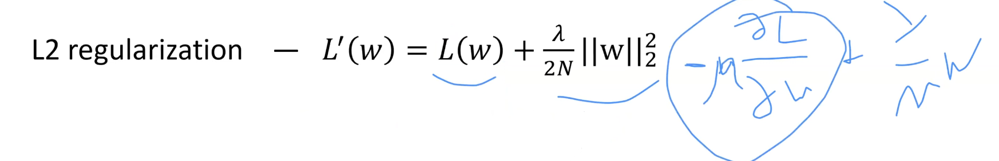
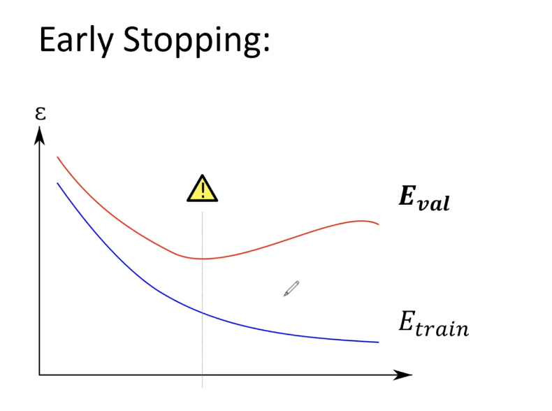
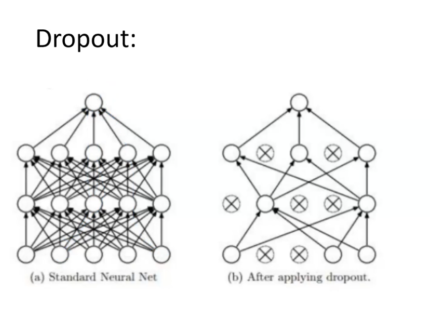

## 15.1) Нейронные сети. Регуляризация, weight decay, ранняя остановка, dropout, аугментация данных.

Лекция: https://www.youtube.com/watch?v=kzhP504D4v8&list=PLxMpIvWUjaJsttwLkYi-uEydy6R9Hk2-v&index=7

Регуляризация - способ контролировать норму весов. Если веса стали громадными, скорее всего мы переобучились на тренировочном датасете и некоторые признаки стали весить необьятно много. Способов её несколько:

1. Увядание весов (L2-регуляризация):

Так же, как и в линейной регрессии, добавляем в качестве слагаемого норму весов. Тогда придется делать компромисс между минимизацией лоссом и неразжирением весов.

Справа - градиент новой функции лосса. Тогда шаг спуска выглядит как $w - \eta(\frac{dL}{dw}) - \frac{\lambda}{N}w$. Добавили коэффициент для того, чтобы идти в сторону уменьшения весов. 

2. Ранняя остановка:

Останавливаемся в тот момент, когда ошибка на валидационном датасете начинает расти.
Используем валидационную выборку для подбора гиперпараметров.

3. Аугментация

Способ борьбы с переобучением из-за маленького датасета. Из датасета пробуем сделать больше данных, чем он есть. Пример с картинкой: вырезать, добавить шум, перевернуть.

4. Dropout

Выключаем некоторые нейроны во время обучения. Но надо домножить сигналы на каждом уровне на $\frac{N}{n}$, n - число включенных нейронов на уровне, N - все, чтобы сумма сигналов осталась прежней. 

## 15.2) Ансамбли. Градиентный бустинг решающих деревьев. XGBoost.

Оставь надежду всяк сюда входящий.

Лекция: https://www.youtube.com/watch?v=bZFIfWzVvUs&list=PLxMpIvWUjaJsttwLkYi-uEydy6R9Hk2-v&index=12
