## 16.1 Реккурентные нейронные сети. LSTM.

[Ссылка на билет (YouTube)](https://youtu.be/wqkQ6qE7KIY?si=yBbXTGs9iFeCL7Q-&t=3611) - с тайм кодом.

### Мотивация
После появления представлений для слов в виде векторов (word2vec, CBOW, skip-gram, etc.) хотим уметь решать различные задачи через нейронные сети. Например, предложим общую схему, как можно реализовать автоматический перевод предложений. У нас есть две части: кодировщик и декодировщик.

- Кодировщик:
    - На каждом шаге принимает очередное слово $x_i$ и собранный для $i$-ого префикса контекст $h_i$.
    - Эти две величины конкатенируются и прогоняются через сетку $W$, в итоге получаем какой-то вектор, который мы добавляем к $h_i$ и получаем $h_{i+1}$ - новый вектор, кодирующий префикс, включающий слово $x_i$ и так далее.
- Декодеровщик:
    - На $i$-ом шаге получает на остаток вектора предложения и декодированное слово с прошлого шага $y_{i}$.
    - Декодирует и получает очередное слово $y_{i+1}$, передает его дальше и остаток предложения (что такое этот остаток пока неясно).

*Note*: индексы для $h_i$ и $y_i$ сдвинуты относительно $x_i$, чтобы соответствовать картинке.

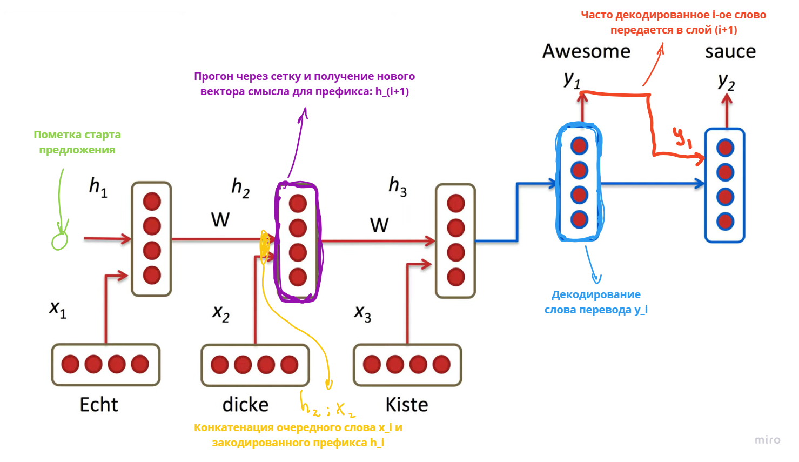

### Общая схема Recurrent Neural Network

В общем случае RNN у нас есть три различные нейронки, определяющие параметры "клеток", которые многократно повторяются:
- $W_{\rightarrow}$: переход из прошлой клетки в следующую, то есть прогон состояния $t-1$ клетки для получения на вход $t$-ой.
- $W_{\uparrow}$: предобработка очередного инпута $x_t$ перед передачей в $t$-ую клетку.
- $W$: нейронка, выдющая по $H_t$ (состоянию текущей клетки) аутпута $y_t$.

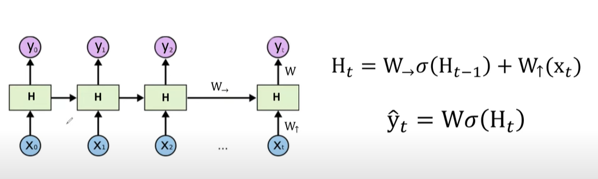

То есть при обучении такой нейронки во время обратного распространения градиента у нас матрица $W_{\rightarrow}$ будет участвовать во всех вычислениях, что может привести к следующим проблемам:
- **Взрыв градиента**: решить можно клиппингом градиента, то есть мы просто ставим ограничинваем градиент какой-то константой.
- **Затухание градиента**: числа в состоянии очередной клетке становятся маленькими, слово $x_i$ на этом шаге начинает слабо влиять на смысл предложения, из-за чего мы можем не учесть реальное влияние этого слова на предложения. **Чтобы с этим бороться существуют LSTM**.

### LSTM (long short-term memory)

Органзация клетки в нейронках с LSTM пользуется концепцией гейтов - это сигмоиды, которые используются для домножения входных/выходных векторов клетки для обеспечениях различных свойств.

На пальцах:
- **Forget gate**: пытается понять, что нам нужно забыть из состояния предыдущей клетки.
- **Input gate**: что нам нужно добавить в состояние текущей клетки перед его передачей в следующую.
- **Output gate**: что нам нужно для генерации аутпута текущей клетки.

Как пересчитывают значения в новой клетке:
- Текущее состояние ($C_t$):
    - Из forget gate мы из сконкатенированных $y_{t-1}$ и $x_t$ путем прогона через нейронку $W_f$ и взятие сигмоиды определяем ту информацию, которую нужно забыть из предыдущего состояния клетки (домножение $C_{t-1} \cdot f_t$).
    - Какую информацию от сконкатенированных $y_{t-1}$ и $x_t$ и прогоненных через нейронку соответствующие нейронки и функции нужно добавить/отнять к вектору состояния клетки.
- Аутпут ($y_t$):
    - Из состояния клетки $C_t$, пропущенного через $\tanh$, определяет что из сконкатенированных $y_{t-1}$ и $x_t$ должно войти в аутпут текущей клетки.

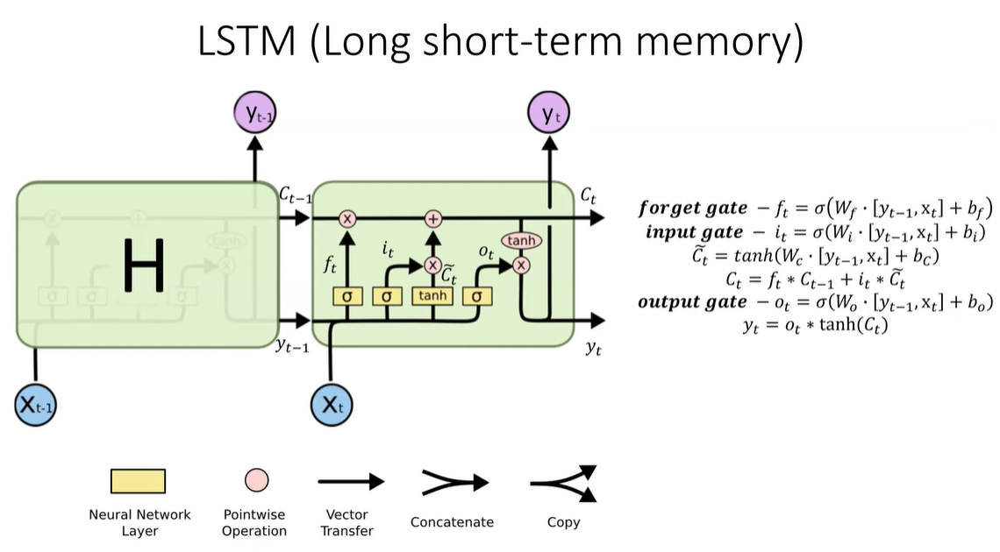

Почему это работает и не позволяет затухать градиенту никто не знает...

### Доп. вопросы по этому билету
- Для чего нужен $\tanh$ в input gate для LSTM (для того, чтобы к текущему состоянию клетки уметь прибалять и отнимать, т.к. значения $\tanh$ лежат в $[-1, 1]$).
- Как гугл сделал машинный перевод на LSTM (Google Neural Machine Translation):
    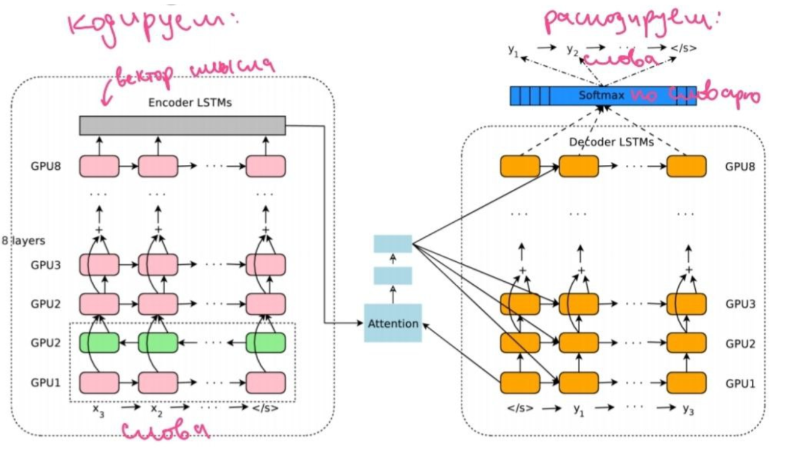

## 16.2 Решающие деревья. Регуляризация и ускорение решающих деревьев.

[Ссылка на билет (YouTube)](https://youtu.be/bZFIfWzVvUs?si=In8gCFgmYVUvvZDe&t=824) - с тайм кодом.

### Решающие деревья

- Есть ноды дерева, в каждой у нас есть распределение классов (число векторов из датасета каждого класса). У нас есть набор фичей и мы хотим делить по распределению классов выбрав некоторый threashold для какой-то фичи.

- Доделившись до листа, определяем все попавшие в будущем элементы в этот лист как класс с наибольшим числом векторов из датасета. 

- Если нода имеет только один класс, то она называется **чистой**.

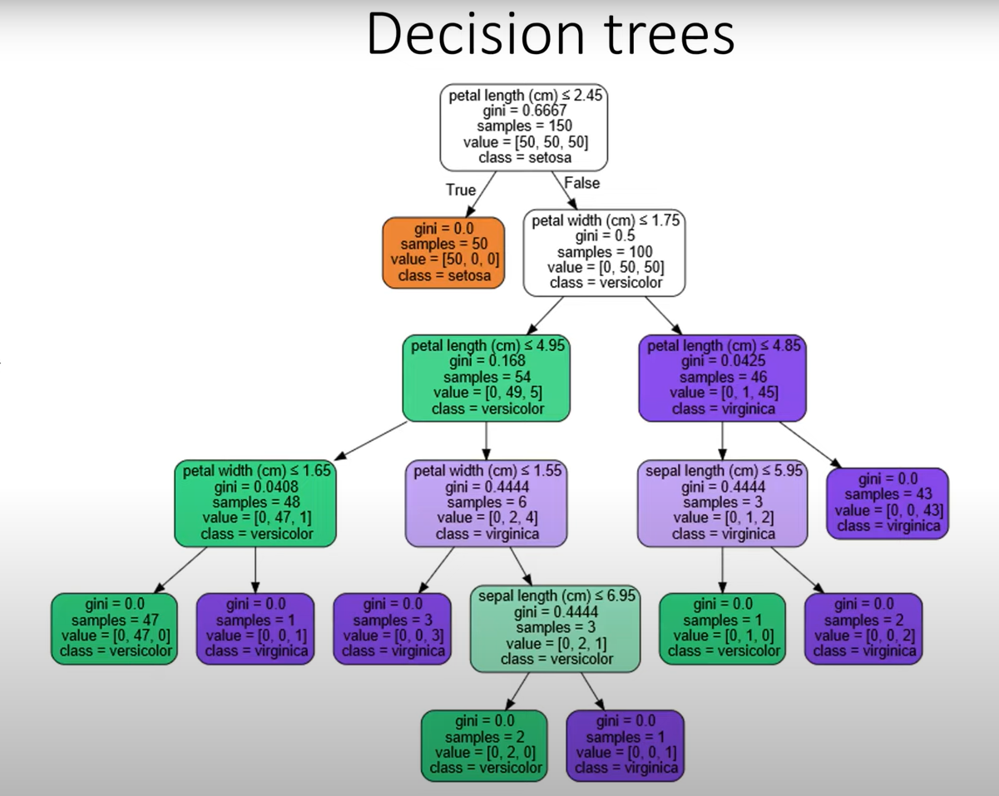

#### Как делиться в ноде
- Перебираем фичу, по которой хотим поделиться, и все threashold'ы
- Выбираем то разбиение, которое максимизирует метрику Information Gain:
    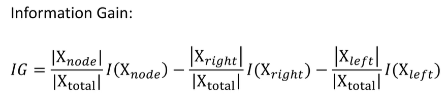
- $I(X_{...})$: это метрика Impurity, она может по-разному задаваться:
    - **Misclassification error**: при выборе в качестве ответа класс с максимальным число попавших точек это будет $(1 - \text{доля этого класса от размера ноды})$
        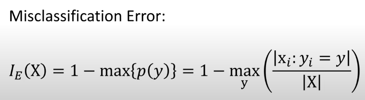
    - **Entropy**: выделить чистую ноду лучше, чем возиться с разюиением, поэтому может приоретизить такие разбиения
        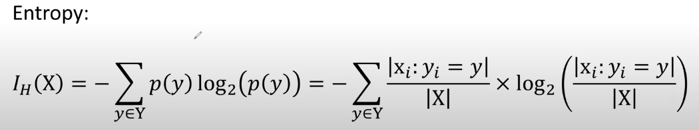
    - **Gini**: считать лоuарифм для все фич и всех threashold долго, поэтому есть такой вариант (смысл: вероятность ошибиться, если мы будет назначать класс, пропорциональное вероятности этого класса в ноде)
        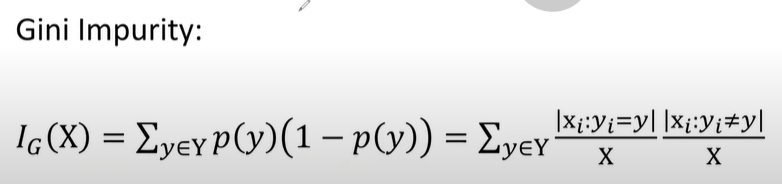

#### Применение

CART (Classification and regression trees)
- Для классификации выдаем номер класса, где максимальное число элементов
- Для регрессии выдаем среднее элементов в листе

### Регуляризация

1. Ограничение глубины дерева
    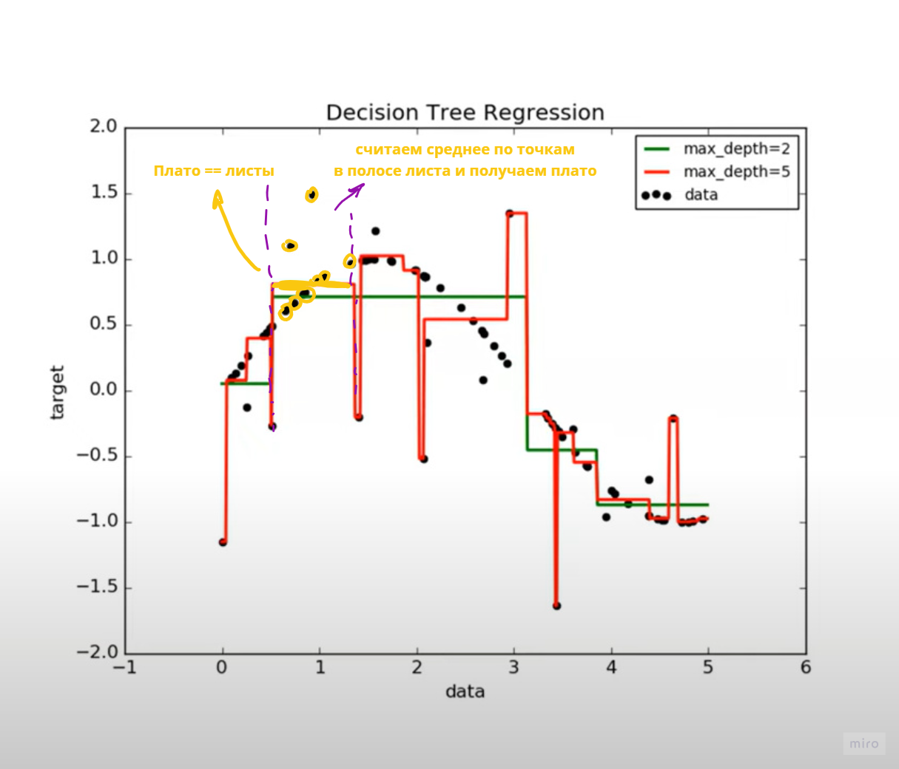
2. Ограничиваем минимальное число точек в листе (чтобы они не были слишком маленькие)
3. Pruning
    - **Minimal error pruning**: делим выборку на тестовый и валидационный датасеты. Строим на тестовом дерево и смотрим, при обрезании какой-то ветки, правда, что ошибка на *валидационной* выборке уменьшится, если да, то обрезаем.
    - **Cost complexity pruning**: пусть добавление нового листа (то есть разбить текущую ноду на две) стоит $\alpha$, тогда мы это делаем только если *валидационная* ошибка уменьшается на $\geq \alpha$ (то есть ошибка дерева становится равной $tree\_error + \alpha \cdot tree\_size$).

### Ускорение

1. Binning: вместо того, чтобы в качестве threshold по конкретной фиче брать все ее значения из датасета (посортили значения и пошли перебирать), мы задаем констанстое число threshold'ов и тыкаем их равномерно в отрезок, где лежат значения фичи.

    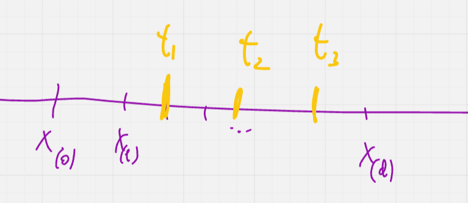

2. Префиксная сумма гистограмм: для подсчет числа элементов в каждом классе мы не заново пробегаемся по всем элементам в ноде, а при переходе между threshold'ами вычитаем гистограмму из правой части и добавляем в левую.

    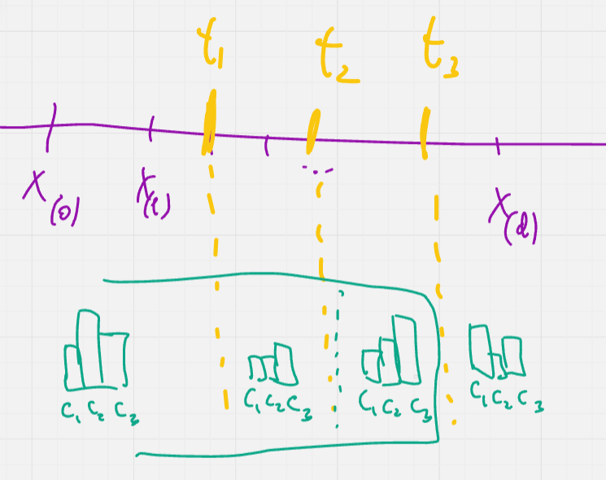

3. Параллелизация

### Доп. вопросы по этому билету
- Преимущества такого решающих деревьев:
    - Интерпретабельность разделения
    - Нет препроцессинга (не нужно нормировать фичи)
    - Числовые и категориальные данные можно разбивать по средствам threashold
    - Устойчивость к аутлайерам
