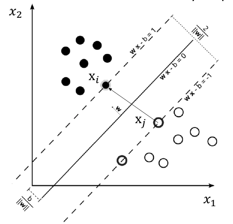
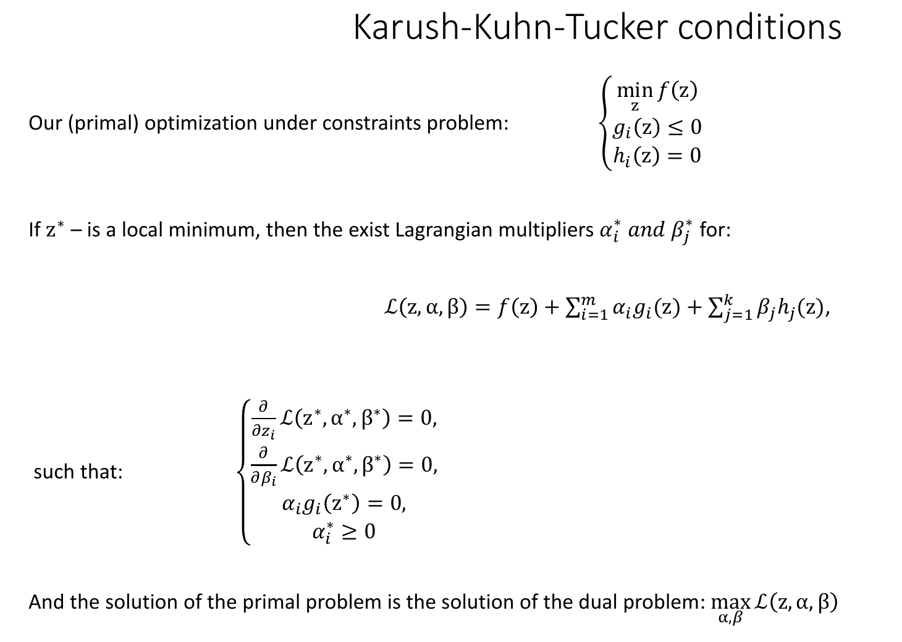
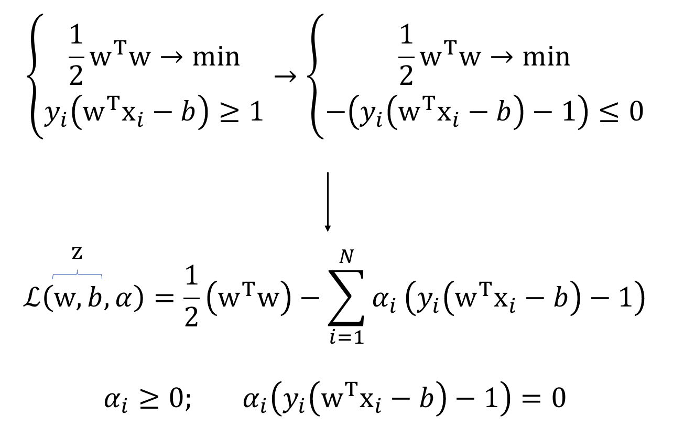
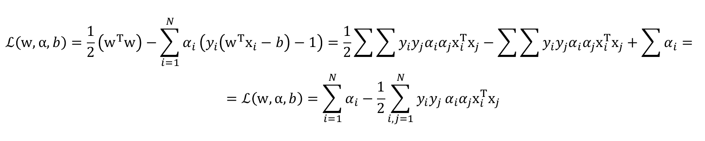
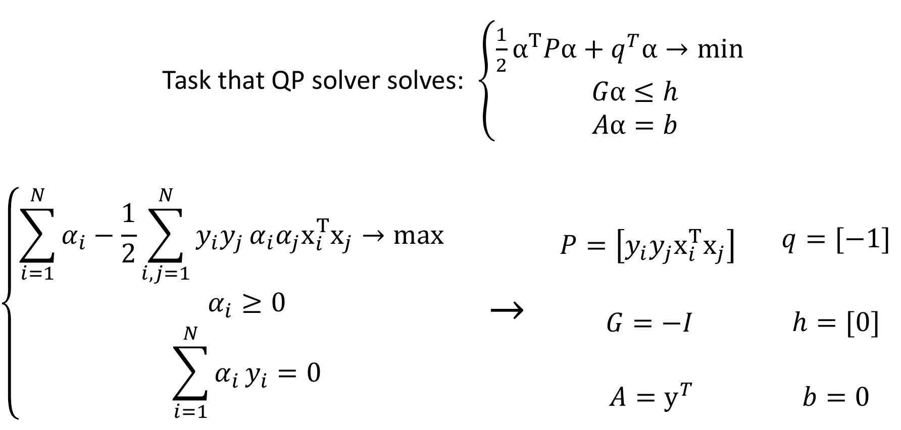

## 18.1 SVM. Линейно разделимая выборка, прямая и двойственная задача. Решение двойственной задачи.

Метод SVM (Support Vector Machines) решает задачу постоения оптимальной разделяющей гиперплоскости.

На картинке: разделяющая гиперплоскость задаётся уравнением $wx - b = 0$, решать уравнение будем так, чтобы ширина полосы была максимальной. Саму полосу определяем как расстояние до ближайших элементов. 

Решение уравнения:

 1) Отнормируем уравнение (поделим $w,b$ на одно и тоже число) так, чтобы значение нашей функции для ближайших точек из классов было $+1, -1$. **Важно понимать:** мы поменяли именно значение функции, сами декартовы расстояния не изменились.
 2) После нормировки получаем: $min \lvert w^Tx_i - b\rvert = min(y_i(w^Tx_i - b)) = 1$, где $y_i$ это $±1$ - индикатор к какому классу относится $x_i$.
 3) Теперь считаем ширину полосы: $\frac{w^T(x_i - x_j)}{\lvert\lvert w \rvert\rvert} = \frac{w^Tx_i - b - (w^Tx_j - b)}{\lvert\lvert w \rvert\rvert} = \frac{2}{\lvert\lvert w \rvert\rvert}$ - тут мы спроецировали отрезок $(x_i, x_j)$ на разделяющую прямую, а затем отнормировали.

Таким образом наша задача: максимизировать $\frac{2}{\lvert\lvert w \rvert\rvert}$ или минимизируем $\lvert\lvert w \rvert\rvert$ или минимизируем $w^Tw$ - всё при условии $y_i(w^Tx_i - b) \geq 1$. Мы будем решать вариант с $$\begin{cases} 
    \frac{1}{2}w^Tw \rightarrow min \\
    y_i(w^Tx_i - b) \geq 1
\end{cases}$$

Решается это методами из кваратичного программирования - выпуклыми оптимизациями, например библиотекой `CVXOPT` - она принимает задачу в виде: $$\begin{cases} 
    \frac{1}{2}\alpha^TP\alpha + q^T\alpha \rightarrow min \\
    G\alpha \leq h \\
    A\alpha = b
\end{cases}$$
Где всё кроме $\alpha$ - переменные, а саму $\alpha$ будем оптимизировать.

В нащем случае: $q = 0,\  P = \mathbb{I},\ G = -Xy_i,\ h=-by_i - 1,\ A = 0,\ b = 0$ - так мы научились решать самый базовый SVM.

Теперь перейдём к двойственной задаче - когда линейно разделить невозможно.

Тут мы вводи Лагранжиан от $z$, в котором второе и третье слагаемые соответствуют второму и третьему уравнению в системе и будем максимизировать этот Лагранжиан. Так же добавим условие на $a_ig_i(z^*) = 0$, тогда в результате ненулевым будет только первое слагаемое, и максимум Лагранжиана будет равен минимуму $f(z)$ - **это не доказывали**.

Тут мы построили Лагранжиан по искомым условиям, стоит отметить, что в под знаком суммы каждое слагаемое равно 0, а значит или $\alpha_i$ или скобка равна 0. 

Тут мы написали два градиента и получили что, наши $w, b$ являются просто линейной комбинацией $x, y$ с коэффициентами из оптимизатора.

Это просто результат подстановки из градиентов, теперь можем снова использовать `CVXOPT` (параметры указал на скрине):

Теперь можем вспомнить, какие условия указывали при построении Лагранжианта и понять, что выгодно почти все $\alpha$ делать равными 0, а значит в $w = \sum_{i = 1}^{N}\alpha_iy_ix_i$ попадает немного $x_i$ - и именно они называются опорными (support) векторами.

Осталось только найти $b$ для этого можем взять $x_i:\ \alpha_i > 0$, и решить $y_i(w^Tx_i - b) - 1 = 0$.

## 18.2 Ансамбли. Жесткое и мягкое голосование. Случайный лес.

### Ансамбли
Ансамбль: это объединение нескольких классификаторов или регрессоров с целью получения лучшего результата, который получается путем голосования. Чаще всего делают ансамбль деревьев.

### Голосование
Виды голосования:
Hard voting – у каждого классификатора один голос, смотрим, в сторону какого класса больше всего голосов среди всех моделей. Но у этого метода есть минус, когда, например, уверенность в классе у какой-то модели будет 0.51, и голос мы отдаем именно за этот класс, хотя по сути это случайный выбор.

Soft Voting – каждый классификатор выдаёт уверенность (probability) в классе, затем они складываются

### Случайный лес
Случайный лес (Random forest) - ансамбль случайных деревьев. Если будем строить много деревьев на одном наборе данных, то все они будут выдавать одинаковый результат, поэтому будет подавать им на вход разные выборки одного датасета:

* Pasting – случайное подмножество датасета

* Bagging (bootstrap aggregating) – случайное подмножество датасета с повторениями того же размера, что и исходный датасет. Берем выборку и случайно выбираем точку, запоминаем ее. Далее снова выбираем точку, запоминаем. Таким образом получим выборку (возможно) с повторениями. Получается, что присваиваем точкам веса, можно присваивать веса, как вероятности из некоторого распределения

* Random subspaces – берём случайное подмножество признаков (features), обычно берется корень из количества признаков (если признаков много)

* Random patches – берём и случайные признаки, и случайные точки (по сути берём "заплатки" из данных и фич)

### Экстремально случайные деревья

Экстремально случайные деревья – разделение внутри дерева случайное, делаем несколько таких итераций, и когда будет наблюдаться перекос, применим голосования. Используется, если модель сильно переобучается (например, на маленьком датасете).
