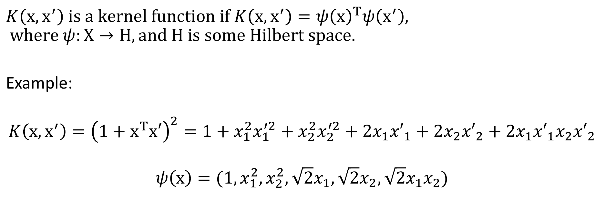
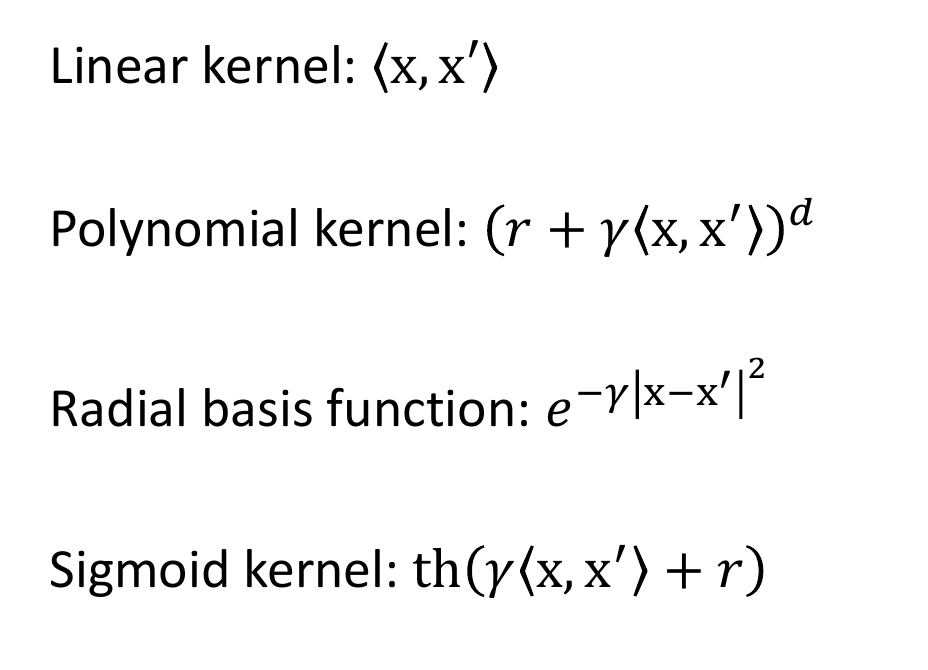
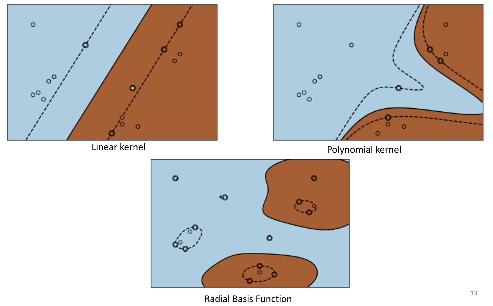
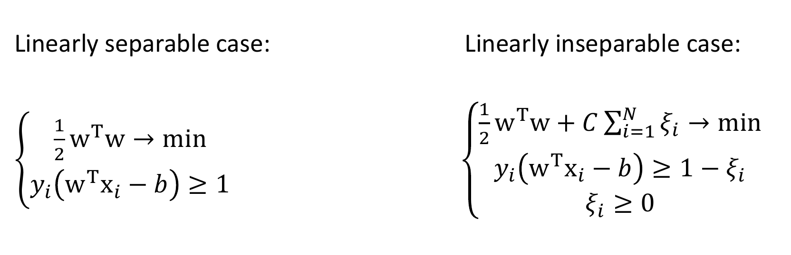
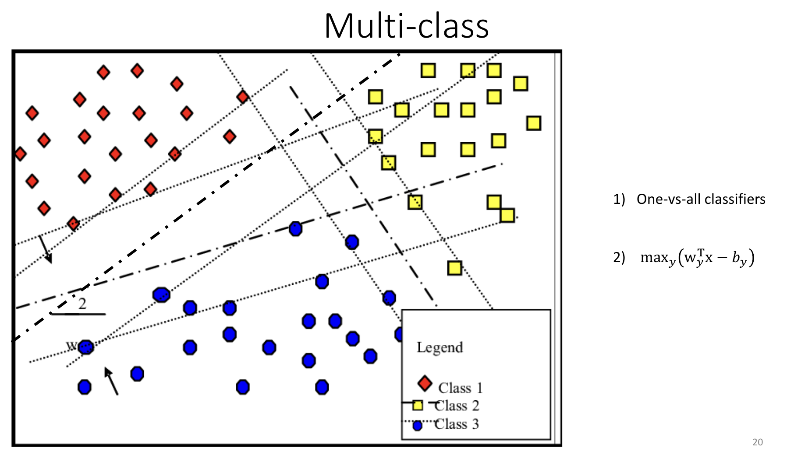
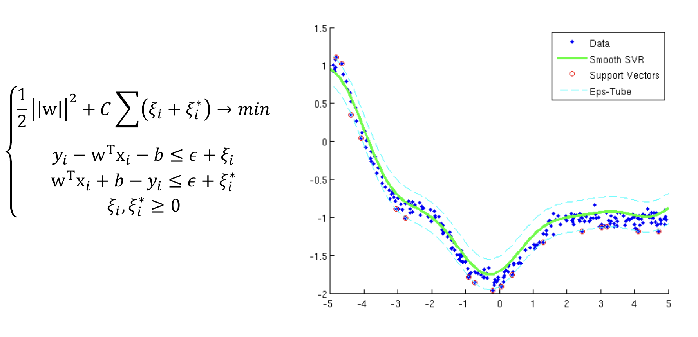

# Билет 19

## 1. SVM, ядерный трюк. SVM для мультиклассовой классификации. SVR.

[ссылка на момент в лекции](https://youtu.be/GpPDPrpIWy4?list=PLxMpIvWUjaJsttwLkYi-uEydy6R9Hk2-v&t=2890)

### Ядерный трюк
Заметим, что чтобы в SVM, который мы уже умеем решать, перейти в пространство большей размерности, нам достаточно научиться считать скалярное произведение по $x$. 

Идея метода:

Получается, что имея корневую функцию, мы определяем необходимое нам скалярное произведение в новом пространстрве, при этом всё что нам было нужно, это уметь считать скалярное произведение в исходном пространстве (на картинке перешли в квадратное), можно написать около $(1 + x^Tx')$ степерь отличную от квадарата и переходить в большие пространства.

Мы обсудили полиномиальное ядро, а ещё бывают:

Radial переводит в бесконечно-мерное пространство, поэтому оно должно быть Гильбертовым.

Картинка как работает SVM для разных ядер:

Теперь мы умеем считать скалярное произведение, но наше $w = \sum_{i = 1}^{N} a_iy_ix_i$ - и его мы найти не можем, но можем сразу посчитать $w^Tx$, просто пременив транспонирование и домножив на $x$. $w^Tx_i = (\sum_{i = 1}^{N} a_iy_ix_i^Tx')_i$

В билете нет, но было на лекции, как ввести штраф за неправильное разделение (в неразделимом случае) fyi:

### SVM для мультиклассовой классификации

Делаем метод один-против-всех, то есть $n$ запусков, где $n$ это количество классов. В результате получим $n$ результатов $±1$ для каждой точки плоскости (относительно каждой разделяющей прямой). Если среди них ровно 1 $+1$, то понятно как выбирать, а если непонятно - будем считать $max_y(w_y^Tx - b_y)$ - и относить к классу $y$.

### SVR (Support Vector Regression Machine)

Тут мы хотим, чтобы все точки наоборот лежали в полосе ширины $\epsilon$, но так же даём возможность нарушать, через систему штрафов.

## 2. Локальный поиск. Отжиг. Генетический алгоритм.

[16.12.2024 1:19:40 на ютубе нет, поэтому ссылка без привязки к времени](https://drive.google.com/drive/folders/10gvaRHs_NQW4v5ULc5b6L83-pPs2zq6g)

**Зачем они нужны:** функции потерь могут быть не дифференцируемы, так что градиент не получится. Например, оптимизация гиперпараметров, задача коммивояжёра (Traveling Salesman Problem). Как-то нужно такое решать. Как?

### Локальный поиск
Локальный поиск (Local search): идея - ищем не во всём пространстве, а на основе локальных данных

### Отжиг
Отжиг (Simulated annealing): добавляем температуру T и выбираем направления как:

* если T большое, то мы вообще по рандому ходим: вероятности становятся похожи.
* если T маленькое, то ходим куда более вероятно в максимум.

**Важно** сделать это несколько раз и выбрать лучшее.

Как он работает: нас сначала мотает по всему пространству, а потом постепенно уменьшается температура, и мы всё таки стараемся идти в максимум. С уменьшением температуры всё аккуратнее и аккуратнее. Потом снова врубаем ядерную колбасню и так далее, когда-нибудь скорее всего максимум найдем

### Генетический алгоритм
Генетический алгоритм (Genetic algo): генерим случайные начальные векторы. Затем их скрещиваем (к примеру, можем по половине из них взять или взять их симметрическую разность) и делаем мутации (чуть-чуть поменяем какие-то координаты). После скрещивания выбираем лучших в популяции, худших убиваем.